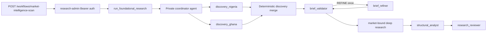

# Foundational Research Pipeline Architecture

## Overview

The `market-intelligence-scan` workflow currently discovers article opportunities in Nigeria and Ghana, validates briefs independently, executes deep research per accepted brief, and returns reviewed research packets without writing or publishing articles. Other supported markets remain disabled until the two-market quality and cost gates pass.

## Topology

## Authority Boundaries

| Boundary | Trusted | Untrusted |
| --- | --- | --- |
| Scan admission | `DiscoveryRunRequestSchema` + auth | HTTP body budgets/focus |
| Discovery scope | Fixed Nigeria/Ghana profile assignments and market-bound tools | Model scope changes |
| Brief acceptance | `brief_validator` + dedup | Orchestrator confidence |
| Brief refinement | `brief_refiner` applies validator changes once without tools | New research, new evidence, recursive delegation |
| Web access | Provider router + URL policy | Queries, pages, redirects |
| Provenance | Application artifact ledger | Model-authored IDs, URLs, receipts |
| Claims | Ledger source/evidence IDs + audit | Model prose, snippets |
| Review | Deterministic evidence reconciliation + rubric | Hidden reasoning |
| Publication | **Not present** | Any embedded request |

## Provider Routing (fixed order)

1. **Search:** Exa only (Apify search is benchmark-only)
2. **Fetch:** Exa Contents → Apify `raw-http` → Apify Playwright (one each max)
3. `APIFY_FALLBACK_ENABLED=false` until benchmark gates pass
4. Every requested and returned URL must use public HTTPS and pass hostname resolution checks
5. Each attempt has its own receipt; failed and cancelled attempts consume an admission estimate

## Budget Allocation

- 25% discovery + brief validation
- 65% deep research (split equally across accepted briefs, then markets)
- 10% remediation (per brief, non-transferable)

Within the discovery allocation, 80% is split equally between Nigeria and Ghana and 20% is reserved for brief validation. Candidate slots are also divided before either task starts. Each market has its own budget tracker, two-search ceiling, four-source fetch ceiling, session, and 90-second task deadline. `maxDiscoveredBriefs` must allow at least one candidate per market. Unused capacity is not transferred while the other market is active.

The default run ceiling is $1.00 and the application ceiling is $1.25. A larger caller value is clamped.

Admission estimates: Exa $0.02/call, Apify raw-http $0.03, Playwright $0.08. Vendor cost may exceed estimate; `overrunUsd` stops new calls. Each article/market allocation and the run allocation are charged by the router.

## Application-Owned Records

Provider results are converted into canonical source, evidence, content-hash, and receipt records before model output is accepted. Discovery and regional outputs may reference only those records. Unsupported factual claims cannot pass review.

Each model task also records its profile, phase, model, token counts, reported cost, prompt/schema/skill versions, status, and error. Article outcomes retain these records when later stages fail.

## Delegation Boundary

Application code owns all stage transitions. It may start one named Flue task for a stage, but a delegated worker cannot call Flue's built-in `task` tool.

Flue 1.0.0-beta.9 exposes `task` to every model turn, including profiles with no declared subagents. An unnamed task clones the current worker into another child session. Prompt instructions do not remove that capability. The workflow therefore registers an execution interceptor that:

- permits application-controlled top-level `session.task(...)` calls;
- denies the `task` tool inside every delegated worker before a child session is created;
- denies any nested task boundary as a second check.

Every worker task also has a wall-clock deadline. A worker never receives another worker as an available execution path. Adding nested delegation requires an architecture decision, a new permission test, and measured evidence that deterministic workflow orchestration cannot perform the transition.

## Flue Interruption Limit

Flue persists runs on Cloudflare but does not resume from arbitrary TypeScript checkpoints. The `research-control-plane` worker adds durable discovery orchestration with SQLite-backed checkpoints and one-action Flue execution. Legacy `market-intelligence-scan` remains available via `RESEARCH_SCAN_MODE=legacy` until rollout gates pass.

## Skill-to-Profile Matrix

| Profile | Model role | Skill | Tools |
| --- | --- | --- | --- |
| discovery_nigeria | fast — DeepSeek V4 Flash | scan-market-signals | Nigeria-bound search_web, fetch_sources |
| discovery_ghana | fast — DeepSeek V4 Flash | scan-market-signals | Ghana-bound search_web, fetch_sources |
| coordinator | fast — DeepSeek V4 Flash | none | direct action binding |
| brief_validator | fast — DeepSeek V4 Flash | validate-research-briefs | one bounded search_web |
| brief_refiner | fast — DeepSeek V4 Flash | refine-research-briefs | none |
| research_* | fast — DeepSeek V4 Flash | research-regional-evidence | market-scoped tools |
| structural_analyst | fast — DeepSeek V4 Flash | analyze-financial-structure | none |
| research_reviewer | analysis — Grok 4.5 | review-research-packets | none |

`emma-finance-article-writer` is reserved for the writing stage and is not attached to research profiles.

## Trade-offs and Expansion

Separate market discovery tasks add one model session per active market, but they prevent budget races, reduce context mixing, and produce market-specific audit records. The deterministic merger does not invent cross-market briefs; comparative stories require a later synthesis stage after both market results exist.

Before enabling another country, add its discovery profile, budget tracker, session attribution rule, source-policy tests, and labeled discovery evaluation set. Expansion requires the new market to pass the same source quality, completion, blocked-call, cost-per-brief, and timeout gates as Nigeria and Ghana.

## Key Modules

- `.flue/research/schemas.ts` — Valibot contracts
- `.flue/research/pipeline.ts` — Deterministic state machine
- `.flue/providers/web-research/router.ts` — Cost-aware provider routing
- `.flue/research/audit.ts` — Source dedup, claim validation
- `.flue/research/ledger.ts` — Application-owned source and evidence records
- `.flue/research/delegation-policy.ts` — Denies model-controlled nested tasks
- `.flue/auth/research-admin.ts` — Bearer token auth (≥32 bytes)
