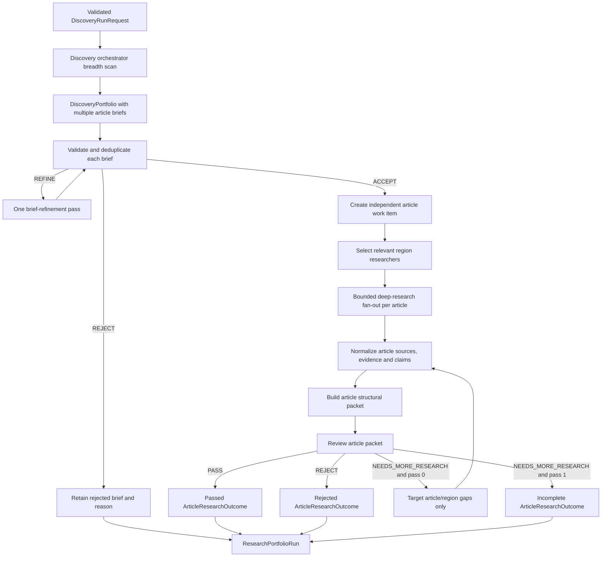

# Foundational Research Pipeline Implementation Plan

## Phase-one market amendment

The active rollout covers Nigeria and Ghana. Discovery is no longer one cross-market task: `discovery_nigeria` and `discovery_ghana` run independently with market-bound tools, equal discovery budget trackers, two searches, four fetched sources, and one market result each. Application code merges those results before brief validation. Kenya, South Africa, and Egypt remain supported by market policy and deep-research profiles but are not admitted to discovery until the two-market quality and cost gates pass.

This amendment replaces later references in this document to one discovery orchestrator, five-market mandatory coverage, and a shared ten-source discovery allowance.

> **For agentic workers:** REQUIRED SUB-SKILL: Use superpowers:subagent-driven-development (recommended) or superpowers:executing-plans to implement this plan task-by-task. Steps use checkbox (`- [ ]`) syntax for tracking.

**Goal:** Build an inspectable Flue workflow that discovers multiple article opportunities, creates and validates one brief per opportunity, executes independent deep research across the relevant African markets, and returns one evidence-preserving research outcome per article without writing or publishing the articles.

**Architecture:** A finite `market-intelligence-scan` workflow receives only run boundaries and binds a reusable Action to a private coordinator. A discovery orchestrator first performs a source-first breadth scan and creates a portfolio of article-level research briefs. A brief validator accepts, refines, or rejects each brief independently. Every accepted brief becomes its own unit of work: the workflow selects the relevant region researchers, gathers deep evidence in separate sessions, builds one structural packet, and runs one reviewer gate for that article. One bounded remediation pass may research explicit reviewer gaps. The workflow returns a portfolio containing many article research outcomes; it never collapses them into one run-level research answer.

**Tech Stack:** TypeScript 5.9, Flue `@flue/runtime` 1.0 beta, Valibot, Cloudflare Workers and Durable Objects, native `fetch`, Exa Search/Contents as the primary research provider, Apify RAG Web Browser as a URL-extraction fallback, an application-owned provider router, Vitest.

## Global Constraints

- `agent/AGENTS.md` is the highest-precedence engineering contract.
- Keep `african-financial-intelligence-pipeline` as the end-to-end editorial reference. Worker profiles MUST receive only their stage skill: `scan-market-signals`, `validate-research-briefs`, `research-regional-evidence`, `analyze-financial-structure`, or `review-research-packets`.
- `emma-finance-article-writer` is reserved for the later writing stage and MUST NOT be attached to this sprint's researchers.
- Every discovery run covers Nigeria, Kenya, Ghana, South Africa, and Egypt. The discovery orchestrator cannot remove one.
- The source sequence, vertical playbooks, ten editor-question minimum, seven analysis layers, dependency graph, 3–5 story options, actionability packet, and reviewer decision rules come from the copied skills and are acceptance criteria.
- This sprint ends at reviewed research packets. It creates no article, EmDash payload, schedule, or publishing capability.
- The publication skill's scheduled-autopublish default is superseded by `agent/AGENTS.md`: publication remains unavailable until its own eval and autonomy promotion gates pass.
- No model receives an API key, arbitrary destination, market scope, source tier, or publish authority through model-selected arguments.
- All model outputs and tool results used by later stages are runtime-validated with Valibot.
- All loops have explicit attempt, concurrency, result-count, timeout, and cost limits.
- Runtime discovery uses Exa only. Apify search is benchmark-only in this sprint because the hosted Actor searches Google from the United States in English.
- Runtime URL extraction tries Exa Contents first, then Apify `raw-http`, then Apify Playwright. Models never select the provider or fallback mode.
- `APIFY_FALLBACK_ENABLED` defaults to `false` and may be set to `true` only after the benchmark fallback gate passes. When disabled, unusable Exa extraction becomes a recorded source gap.
- `maxProviderCostUsd` controls Exa and Apify spend only. A request may lower the configured run ceiling but cannot raise it.
- `maxProviderRequests` caps all provider HTTP attempts, including failed vendor requests and fallbacks. It defaults to 40 and cannot exceed 100.
- Models never supply search dates or fetch URLs. Tool factories apply server-owned windows, and `fetch_sources` accepts only source IDs returned by that tool instance.
- Production Exa calls make one attempt. Automatic retries are disabled because failed calls may be billed.
- Manual workflow and run-inspection routes require `Authorization: Bearer ${RESEARCH_ADMIN_TOKEN}`. The token is a Worker secret with at least 32 random bytes and never appears in a URL, model context, receipt, or log.

---

## 1. Scope and success boundary

### Included in this sprint

- Authenticated manual endpoint and minimal run/timeframe request contracts.
- Orchestrator-led source-first signal discovery across all five mandatory markets.
- Multiple article-level briefs generated from discovered signals.
- Independent validation and deduplication of every proposed brief.
- Separate deep-research child sessions selected for every accepted article brief.
- Source-first discovery followed by broader discovery only when required.
- Exa discovery and first-pass URL extraction through a provider adapter.
- Apify URL extraction fallback for selected pages that Exa cannot return as usable attributable content.
- Per-call provider usage receipts, fallback reasons, latency, and cost accounting.
- Provider-call receipts, source records, excerpts, claim candidates, source gaps, and agent execution records.
- Deterministic canonical-URL normalization, ID generation, deduplication, tier checks, and completeness checks.
- One structural analysis packet and reviewer gate per article.
- One targeted remediation pass per article for `NEEDS_MORE_RESEARCH`.
- A final research portfolio containing detailed outcomes for every discovered, accepted, rejected, and incomplete article candidate.
- Unit tests, integration tests with a fake provider/delegator, and an initial provider benchmark fixture.

### Explicitly excluded

- Article drafting, editorial refinement, EmDash publication, corrections, and retractions.
- Graph database writes, ontology design, entity resolution, or edge acceptance.
- Social-platform scraping and authenticated platform APIs.
- Recurring schedules.
- Step-level recovery after a Cloudflare process interruption.

Flue persists workflow inputs, run records, events, and terminal results on Cloudflare, but it does not resume a workflow from arbitrary TypeScript checkpoints after interruption. Production autonomy therefore remains blocked until a later phase adds application-owned artifact storage and Cloudflare Workflows for durable step continuation. A normal region/provider failure in this sprint returns a typed `partial` result rather than discarding successful regions.

## 2. Flue primitive mapping

| Concern | Flue primitive | Project use |
| --- | --- | --- |
| Finite scan with one run ID and event history | Workflow | `market-intelligence-scan` |
| Reusable deterministic sequence | Action | `run_foundational_research` |
| Execution policy for the workflow | Private agent definition | Coordinator model, skills, and subagents; no public route |
| Discovery orchestrator and specialists | Agent profiles/subagents | Separate child sessions and explicit capabilities |
| Search and extraction | Tools | Bounded application functions over `WebResearchProvider` |
| Editorial rules | Skills | Explicitly registered per profile because subagents do not inherit parent skills |
| Provider call and phase audit | Flue events plus result records | Tool receipts, structured logs, agent execution records |

Flue references used for this design:

- Agents: https://flueframework.com/docs/guide/building-agents/
- Workflows: https://flueframework.com/docs/guide/workflows/
- Actions: https://flueframework.com/docs/guide/actions/
- Tools: https://flueframework.com/docs/guide/tools/
- Skills: https://flueframework.com/docs/guide/skills/
- Subagents: https://flueframework.com/docs/guide/subagents/
- Cloudflare recovery boundary: https://flueframework.com/docs/ecosystem/deploy/cloudflare/

## 3. Agent topology

### Private coordinator

The workflow binds one private coordinator agent. It is not placed in `.flue/agents/`, receives no public endpoint, and contains all declared subagent profiles. Its Action controls discovery, brief validation, article fan-out, research, analysis, and review.

### `discovery_orchestrator`

- Model role: `reasoning`.
- Skills: `african-financial-intelligence-pipeline`.
- Tools: breadth-limited, market-aware `search_web` and `fetch_sources`.
- Input: validated `DiscoveryRunRequest`, market/source policies, vertical policies, and prior-run exclusions when supplied.
- Output: `DiscoveryPortfolio` containing provider-call receipts, candidate signals, and one `ArticleResearchBrief` per proposed article.
- Responsibility: perform the initial breadth scan, find decision-relevant signals, connect each proposed article to discovery evidence, and define the market/topic scope for later deep research.
- It cannot validate its own briefs, conduct the final deep research, approve an article packet, or publish.

### `brief_validator`

- Model role: `reasoning`.
- Skills: `african-financial-intelligence-pipeline`.
- Tools: narrowly bounded source verification only.
- Input: one `ArticleResearchBrief` and its discovery evidence.
- Output: `ACCEPT`, `REFINE`, or `REJECT`, with exact reasons, duplicate-candidate references, missing scope, and required source targets.
- Responsibility: verify that the signal exists, is decision-relevant, is not routine promotion, has a researchable thesis, and deserves a deep-research allocation.
- It cannot rewrite evidence, approve the later article packet, or publish.

### Region researchers

Profiles: `research_nigeria`, `research_kenya`, `research_ghana`, `research_south_africa`, `research_egypt`.

- Model role: `default` initially. Model downgrades require eval evidence.
- Skills: `african-financial-intelligence-pipeline` explicitly on each profile.
- Tools: only region-bound `search_web` and `fetch_sources` instances.
- Input: one accepted article brief, the assigned market scope, article questions, source policy, and per-article research budget.
- Output: `ArticleRegionResearchResult` containing provider-call receipts, source records, evidence excerpts, literal facts, claim candidates, and unresolved gaps for that article.
- Each article/market pair uses a separate named Flue session such as `article:<briefId>:region:nigeria`.
- Researchers cannot write cross-market conclusions, approve packets, draft articles, or publish.

Create the five profiles through one factory so policy stays consistent while tool scope and prompts remain market-specific.

### `structural_analyst`

- Model role: `reasoning`.
- Skills: `african-financial-intelligence-pipeline`.
- Tools: none in this sprint.
- Input: the normalized evidence packet for one article only.
- Output: facts, at least ten editor's questions, researched answers or explicit gaps, dependency graph candidates, all seven analysis layers, 3–5 story options, recommended lede, and actor-specific actionability.
- It may not add a factual claim whose supporting source IDs are absent from input.

### `research_reviewer`

- Model role: `reasoning` or `premium` only after cost measurement.
- Skills: `african-financial-intelligence-pipeline`.
- Tools: none.
- Input: one article packet, its source audit, proposed output type, and the copied reviewer rubric.
- Output: the exact reviewer schema with `PASS`, `NEEDS_MORE_RESEARCH`, or `REJECT`, dimension scores, reasons, missing items, and requested source targets.
- It cannot mutate the packet or publish.

### Later profiles, not part of this sprint

- `article_writer`: receives only reviewer-passed packets and the writer skill.
- `article_evaluator`: checks claim/source bindings and editorial rubric independently.
- `article_refiner`: changes a draft only against recorded findings.
- `publisher`: receives only approved artifact hashes and EmDash write tools.

## 4. Deterministic execution flow



Concurrency is bounded twice: brief validation/article execution, then region research within an article. Set `MAX_CONCURRENT_BRIEF_VALIDATIONS = 4`, `MAX_CONCURRENT_ARTICLES = 3`, `MAX_CONCURRENT_REGIONS_PER_ARTICLE = 2`, `MAX_CONCURRENT_PROVIDER_CALLS = 4`, and `MAX_CONCURRENT_APIFY_RUNS = 1`. Provider `429` responses reduce global provider concurrency to `1` for the rest of the run. One failed article or region cannot erase completed outcomes from other articles.

## 5. Data contracts

Create Valibot schemas and inferred TypeScript types for these records.

```ts
type Market = 'nigeria' | 'kenya' | 'ghana' | 'south-africa' | 'egypt';
type SourceTier = 1 | 2 | 3;
type ReviewDecision = 'PASS' | 'NEEDS_MORE_RESEARCH' | 'REJECT';
type RunStatus = 'complete' | 'partial' | 'failed';

interface DiscoveryRunRequest {
  runKey: string;
  trigger: 'manual' | 'scheduled';
  window: { start: string; end: string };
  focus: string | null;
  maxDiscoveredBriefs: number;
  maxAcceptedBriefs: number;
  maxProviderCostUsd: number | null;
  maxProviderRequests?: number;
}

interface ArticleResearchBrief {
  briefId: string;
  workingTitle: string;
  thesis: string;
  signalSummary: string;
  markets: Market[];
  verticals: string[];
  discoverySourceIds: string[];
  discoveryEvidenceIds: string[];
  decisionRelevance: string;
  initialQuestions: string[];
  primarySourceTargets: string[];
  secondarySourceTargets: string[];
  exclusions: string[];
}

interface BriefValidation {
  briefId: string;
  briefVersion: string;
  decision: 'ACCEPT' | 'REFINE' | 'REJECT';
  reasons: string[];
  duplicateOfBriefId: string | null;
  requiredChanges: string[];
  requestedSourceTargets: string[];
}

type ResearchProvider = 'exa' | 'apify';
type ProviderOperation = 'search' | 'fetch';

interface ProviderCallReceipt {
  receiptId: string;
  callKey: string;
  provider: ResearchProvider;
  providerRequestId: string | null;
  operation: ProviderOperation;
  mode: 'search' | 'highlights' | 'full-text' | 'raw-http' | 'browser-playwright';
  phase: 'discovery' | 'deep-research' | 'remediation';
  briefId: string | null;
  market: Market;
  query: string | null;
  requestedUrls: string[];
  sourceTier: SourceTier;
  requestedAt: string;
  completedAt: string;
  resultUrls: string[];
  costUsd: number | null;
  latencyMs: number;
  status: 'succeeded' | 'failed' | 'cancelled';
  fallbackReason: 'exa-unusable' | 'exa-retry-exhausted' | 'raw-http-unusable' | null;
  usage: {
    computeUnits: number | null;
    externalTransferGbytes: number | null;
    proxySerps: number | null;
  };
}

interface SourceRecord {
  sourceId: string;
  canonicalUrl: string;
  title: string;
  publisher: string | null;
  author: string | null;
  publishedAt: string | null;
  retrievedAt: string;
  market: Market;
  tier: SourceTier;
  sourceType: 'primary' | 'secondary' | 'social';
  receiptIds: string[];
  contentHash: string | null;
  rightsNote: string | null;
}

interface EvidenceExcerpt {
  evidenceId: string;
  sourceId: string;
  text: string;
  supports: string[];
  capturedAt: string;
}

interface ClaimCandidate {
  claimId: string;
  statement: string;
  kind: 'fact' | 'reported-claim' | 'inference';
  materiality: 'low' | 'medium' | 'high';
  supportingEvidenceIds: string[];
  contradictingEvidenceIds: string[];
  status: 'supported' | 'disputed' | 'unsupported';
}

interface ArticleResearchOutcome {
  brief: ArticleResearchBrief;
  validation: BriefValidation;
  status: 'passed' | 'needs-more-research' | 'rejected' | 'failed';
  regionResults: ArticleRegionResearchResult[];
  sourceAudit: SourceAudit;
  structuralPacket: StructuralPacket | null;
  review: ReviewReport | null;
  execution: AgentExecutionRecord[];
}

interface ResearchPortfolioRun {
  runKey: string;
  status: RunStatus;
  discovery: DiscoveryPortfolio;
  articles: ArticleResearchOutcome[];
  rejectedBriefs: Array<{ brief: ArticleResearchBrief; validation: BriefValidation }>;
  providerUsage: {
    requestedBudgetUsd: number | null;
    effectiveBudgetUsd: number;
    admittedEstimateUsd: number;
    actualCostUsd: number;
    unpricedCallCount: number;
    overrunUsd: number;
    receipts: ProviderCallReceipt[];
  };
  totals: {
    discovered: number;
    accepted: number;
    passed: number;
    incomplete: number;
    rejected: number;
  };
}
```

`DiscoveryPortfolio`, `ArticleRegionResearchResult`, `SourceAudit`, `StructuralPacket`, `ReviewReport`, and `AgentExecutionRecord` complete these primitives. The final `ResearchPortfolioRun` MUST contain one `ArticleResearchOutcome` for every accepted brief and retain every rejected brief and source gap. Absence is not evidence that discovery covered a market or topic.

Graph preparation in this sprint is limited to stable IDs and provenance. `EntityMention` and `RelationshipCandidate` may be included as unaccepted annotations, but no URI, node, or edge becomes authoritative until the future graph phase runs entity resolution and ontology validation.

Provider page bodies are transient run inputs. Persist source metadata, content hash, bounded evidence excerpts, claim bindings, and provider-call receipts; do not place complete third-party page bodies in `ResearchPortfolioRun`, logs, test fixtures, or benchmark reports. Primary documents may be fetched again from their canonical URL in a later stage.

## 6. Web research provider decision

### Runtime routing policy

Use direct HTTPS calls rather than adding vendor SDK packages in the first slice.

1. `search()` always uses Exa Search. It applies application-owned market domains, publication/crawl windows, result limits, and highlights. Apify search MUST NOT run in the production workflow during this sprint because the hosted RAG Web Browser searches Google from the United States in English.
2. `fetch()` first calls Exa Contents for a shortlisted canonical HTTPS URL. Exa full text is requested only when highlights cannot support the evidence question.
3. The router calls Apify only when `isUsableExtraction()` rejects the single Exa extraction result. A usable extraction has a public final HTTPS URL, no provider/schema error, at least 200 normalized non-whitespace characters, and at least 40 unique case-folded word tokens. Normalize line endings and whitespace, remove empty lines, and remove any identical line occurring three or more times before measuring. Reject content when its title or first 300 normalized characters contains `access denied`, `forbidden`, `enable javascript`, `sign in`, `log in`, `verify you are human`, `captcha`, or `cookie settings` and the full normalized content is under 1,500 characters. PDFs must pass the same character and token thresholds.
4. The Apify adapter tries `raw-http` first. It may try `browser-playwright` once only when `raw-http` returns an unusable extraction and provider budget remains.
5. The workflow uses normal Actor runs, not Standby. Manual scans do not justify paying for an idle container. A later load test may approve Standby when measured request volume and latency requirements support it.
6. `APIFY_FALLBACK_ENABLED` is application configuration. The router does not call Apify when it is `false`, even when credentials exist.

Do not use Exa synthesized answers, Apify-generated summaries, or search snippets as evidence. Models receive result metadata and attributable source text or highlights. The publication system owns claims and reviewer decisions.

### Cost policy

- `RESEARCH_PROVIDER_DEFAULT_RUN_USD = 1.00` and `RESEARCH_PROVIDER_HARD_RUN_USD = 1.25` are application configuration, not model inputs.
- `DiscoveryRunRequest.maxProviderCostUsd` is a nullable requested ceiling. The effective ceiling is `Math.min(request.maxProviderCostUsd ?? RESEARCH_PROVIDER_DEFAULT_RUN_USD, RESEARCH_PROVIDER_HARD_RUN_USD)`.
- Reserve 25% of the effective ceiling for discovery and brief validation, 65% for accepted-brief deep research, and 10% for remediation. Unused earlier allocation may move forward; later allocation may not move backward.
- After brief validation, split the deep-research allocation equally across accepted briefs, then split each brief allocation equally across its assigned markets. Calculate allocations before concurrent work begins; completion order cannot change them.
- Split the remediation allocation equally across accepted briefs. A brief that does not need remediation leaves its allocation unspent; another brief cannot consume it.
- Before every provider call, the router checks remaining dollars and the run-wide request count. It does not start a call whose configured worst-case estimate exceeds the remaining allocation or whose request would exceed `maxProviderRequests`.
- Exa search uses at most 10 results. Discovery requests highlights first. Full text is limited to selected URLs.
- Enforce `MAX_DISCOVERED_BRIEFS = 30` and `MAX_ACCEPTED_BRIEFS = 10`. A caller may request lower values only.
- Discovery may issue at most 2 search calls per market and 10 source attempts in total. Brief validation may issue at most 1 verification search per brief. Deep research may issue at most 4 searches and attempt at most 6 selected sources per article-market pair. Remediation may issue at most 2 searches and attempt at most 3 sources per article-market pair.
- Count tool attempts before validation or provider execution. Invalid source IDs and provider failures consume the local stage allowance.
- Exa Search has a 15-second request deadline. Exa Contents has a 30-second request deadline. Apify raw-HTTP has a 90-second total run/poll deadline; Playwright has a 120-second deadline. Provider response bodies are capped at 2 MiB and accepted normalized content at 60,000 characters per source. Evidence excerpts are capped at 4,000 characters each.
- Apify receives one selected URL per fallback call in this sprint. `raw-http` is mandatory before Playwright for every URL, including PDFs.
- Every Exa response records its reported request cost when present. Every Apify run reads `usageTotalUsd` after completion. Missing cost data is `null`, increments `unpricedCallCount`, and consumes the configured worst-case estimate for admission control.
- The run stops new provider calls when the ceiling is reached. It retains completed work and returns `partial`.
- The ceiling governs admitted estimated spend. A vendor may report a final cost above its admission estimate. If that occurs, set `overrunUsd`, stop every not-yet-started call, and return `partial`; never describe the provider invoice as absolutely capped.
- Model-token cost is recorded separately when the runtime exposes it. `maxProviderCostUsd` does not claim to cap model spend.

The initial worst-case admission estimates are `$0.02` per Exa Search or Contents call, `$0.03` per Apify `raw-http` call, and `$0.08` per Apify Playwright call. Replace an estimate only after the benchmark records at least 100 calls for that provider/mode and the new estimate is at or above observed p95 cost.

Provider references used for this decision:

- Exa pricing: https://exa.ai/pricing
- Exa Search: https://exa.ai/docs/reference/search
- Exa Contents: https://exa.ai/docs/reference/contents
- Apify RAG Web Browser: https://apify.com/apify/rag-web-browser
- Apify RAG Web Browser input: https://apify.com/apify/rag-web-browser/input-schema
- Apify platform pricing: https://apify.com/pricing
- Apify Standby billing: https://docs.apify.com/actors/running/standby

### Provider interface

```ts
export interface WebResearchProvider {
  search(input: WebSearchInput, signal: AbortSignal): Promise<WebSearchResponse>;
  fetch(input: WebFetchInput, signal: AbortSignal): Promise<WebFetchResponse>;
}

export interface WebExtractionProvider {
  fetch(input: WebFetchInput, signal: AbortSignal): Promise<WebFetchResponse>;
}
```

`ExaWebResearchProvider` implements search and fetch. `ApifyWebExtractionProvider` implements fetch only; the runtime has no Apify search method. `CostAwareWebResearchRouter` owns the fixed provider order and fallback decisions. Vendor adapters own authentication, timeout, response parsing, usage parsing, and error redaction. Tool factories own market/domain scope, server-owned date windows, source selection, and per-call bounds. The model selects a query and source IDs returned by `search_web`; it never selects a URL, provider, API key, arbitrary headers, scraping mode, or unrestricted domain policy.

Both adapters reject non-HTTPS input URLs, credential-bearing input URLs, input hosts that resolve to private/link-local/loopback addresses, provider results with a non-public final URL, and responses above the configured byte limit. Exa and Apify perform source-page requests inside their own services, so the application cannot inspect their intermediate redirect hops. The adapter therefore validates before submission and again against the provider-reported final URL; it must not claim hop-by-hop enforcement.

### Provider benchmark before production use

Create 25 labeled discovery queries: five per mandatory market, with one case per market for regulation, institutional performance, capital flows, technology infrastructure, and market signals. Run discovery quality cases against Exa. Run Apify search only as a benchmark comparison; its result cannot change runtime routing in this sprint. Add 20 extraction URLs containing static HTML, JavaScript-rendered pages, PDFs, regulator pages, access-denied pages, redirects, and boilerplate-heavy pages. Run those URLs through Exa, Apify `raw-http`, and Apify Playwright where applicable. Record:

- primary-source recall at 10;
- proportion of results with usable publication dates;
- proportion of selected URLs that produce attributable excerpts;
- duplicate-domain and duplicate-URL rates;
- stale-result rate against the requested window;
- p50/p95 latency;
- provider errors and rate limits;
- cost per usable source;
- fallback rate by reason and provider mode;
- p50/p95 cost per call and per usable extraction;
- regional primary-source recall by market, not only the five-market aggregate.

Initial promotion gates: Exa primary-source recall at 10 of at least `0.80` in every market, attributable excerpt extraction of at least `0.90` across the combined extraction set, no internal/private URL access, no unbounded response, and complete cost receipts or conservative admission estimates for every call. Apify is promoted only as a fetch fallback when at least five benchmark URLs are Exa-unusable, it recovers at least `0.20` of those URLs, attribution accuracy remains at least `0.90`, and p95 cost per recovered extraction is no more than `$0.08`. These are release criteria to test, not measured claims. Failure blocks live-provider promotion; fake-provider workflow development may continue.

## 7. Invariants

- Discovery produces an explicit coverage record for every mandatory market, even when it finds no candidate.
- The discovery orchestrator cannot change mandatory market scope, source policy, accepted-brief limit, or system budgets.
- Every proposed article has its own stable brief ID, validation result, deep-research allocation, source audit, structural packet, and review result.
- Every accepted brief produces exactly one terminal `ArticleResearchOutcome`; outcomes are never merged merely because they share a market or topic.
- Duplicate briefs are linked and rejected or merged before deep-research allocation.
- A region tool cannot search under another region's bound market identity.
- Every source ID is derived from a normalized canonical URL; every evidence record points to an existing source ID.
- Every factual claim points to at least one evidence ID. Otherwise its status is `unsupported` and it cannot enter a passing packet.
- Search snippets alone are discovery data. Passing evidence requires captured attributable content from the underlying URL.
- Exa is the only runtime search provider in this sprint; an Apify search result cannot enter discovery output.
- Apify receives only canonical URLs already selected from discovery or validation. It cannot expand article or market scope.
- Apify fallback remains disabled until its dated benchmark report passes every fallback promotion gate.
- Provider fallback order is fixed as Exa Contents, Apify `raw-http`, then Apify Playwright. A model cannot skip, reorder, or repeat these stages.
- Every provider call has a `ProviderCallReceipt`, including failed and cancelled calls. Missing vendor cost data is never treated as zero.
- Every provider attempt has a stable `callKey` derived from run, brief, market, phase, operation, canonical URL or normalized query, provider, mode, and attempt number. The router will not execute the same `callKey` twice within a run.
- The effective provider budget cannot exceed the application hard ceiling, even when a caller supplies a larger number.
- Concurrent completion order cannot move provider budget between accepted briefs or markets.
- Provider content is untrusted. Input URLs and provider-reported final URLs are checked against the public-HTTPS policy before content reaches a model.
- Complete third-party page bodies never enter terminal workflow results or logs; only bounded excerpts and hashes persist.
- Tier 3/social evidence cannot be the sole support for a material factual claim.
- Company statements remain `reported-claim` unless independently supported.
- Reviewer scores are recomputed from the final packet. Earlier reviewer output cannot approve a changed packet.
- A `PASS` requires the exact copied-skill thresholds, ten editor's questions, seven layers, a dependency graph, 3–5 story options, and explicit gaps.
- One brief-refinement pass and one research-remediation pass per article are the maximum. Exhaustion returns an incomplete article outcome; it does not silently accept weaker evidence.
- No tool in this sprint can publish or write to EmDash.
- Cost exhaustion stops new provider calls, preserves completed article and region results, and returns `partial`.
- Provider, model, prompt, schema, and skill versions are present in each execution record.

## 8. Trust boundaries and ownership

| Boundary | Trusted authority | Untrusted input |
| --- | --- | --- |
| Scan admission | Workflow input schema and authenticated route | HTTP body and caller-provided focus/budgets |
| Discovery scope | Application-owned market/source policy | Orchestrator-selected scope changes |
| Brief acceptance | Versioned brief validator and duplicate checks | Orchestrator's own confidence in its candidates |
| Web access | Provider router, adapters, URL validator, and tool factory | Queries, redirects, pages, PDFs, snippets, page instructions |
| Claims | Source/evidence IDs plus deterministic audit | Model prose, provider summaries, company promotion |
| Review | Versioned reviewer schema and rubric | Hidden model reasoning or unsupported confidence |
| Publication | Not present in this sprint | Any request embedded in research content |

Ownership keys are `runKey`, `briefId`, `briefVersion`, `market`, `receiptId`, `sourceId`, `evidenceId`, `claimId`, and article packet ID. Reads and merges MUST scope records by `runKey` and `briefId`; a rerun with the same `runKey` must not duplicate article work or external actions.

`research-admin.ts` owns route authentication. It requires one Bearer token, rejects query-string credentials, validates that the configured secret is at least 32 bytes, compares SHA-256 digests without an early-exit byte comparison, returns the same `401` body for missing and invalid caller tokens, and fails closed with `503` when the Worker secret is absent or invalid. Authentication happens before request-body parsing or run lookup.

## 9. Failure behavior

| Failure | Behavior |
| --- | --- |
| Discovery schema invalid | One validator-feedback retry; then fail before brief validation. |
| One brief validator fails | Preserve the candidate as failed and continue other briefs. |
| One article or region task fails | Preserve its failure record and continue other articles; final run status is `partial`. |
| Exa timeout/5xx | Retry at most twice with bounded exponential backoff and jitter. |
| Apify start request has an ambiguous timeout/5xx | Do not issue a second Actor start, because the first run may exist and incur cost. Record an unknown-start failure for operator reconciliation. |
| Apify status/dataset GET timeout/5xx | Retry the GET at most twice; do not start another Actor. |
| Provider 429 | Record the failed attempt, lower concurrency for later calls, and stop this operation. Do not retry automatically. |
| Provider 400/auth | Do not retry; return configuration or validation failure. |
| Malformed provider data | Fail that call closed and retain redacted response metadata. |
| Exa search unavailable | Do not substitute Apify search. Mark the affected discovery coverage failed and return `partial` or `failed` according to completed coverage. |
| Exa extraction unusable | Record the reason and try Apify `raw-http` if budget remains. |
| Apify `raw-http` unusable | Record the reason and try Playwright once if budget remains. |
| Apify Playwright unusable | Preserve the source metadata, record an extraction gap, and continue without evidence from that URL. |
| Provider cost missing | Charge the admission estimate, increment `unpricedCallCount`, and retain `costUsd: null`. |
| Provider reports a non-public final URL | Discard the content and record a terminal URL-policy failure. |
| Duplicate URL | Merge receipt IDs and market evidence; never discard provenance. |
| Missing publication date | Keep `null`, mark freshness gap, and block time-sensitive claims from PASS. |
| Unsupported factual claim | Mark unsupported and force reviewer rejection or more research. |
| Reviewer invalid output | One schema-feedback retry; then terminal `failed`. |
| Cost budget exhausted | Cancel remaining provider calls and return completed work as `partial`. |
| Cloudflare workflow interruption | Flue records an interrupted run; caller may start a new run. Production scheduling remains blocked until durable step orchestration exists. |

## 10. File map

```text
.flue/
├── actions/
│   └── run-foundational-research.ts
├── auth/
│   └── research-admin.ts
├── agents/
│   └── profiles/
│       ├── brief-validator.ts
│       ├── coordinator.ts
│       ├── discovery-orchestrator.ts
│       ├── region-researcher.ts
│       ├── research-reviewer.ts
│       └── structural-analyst.ts
├── research/
│   ├── audit.ts
│   ├── concurrency.ts
│   ├── delegation.ts
│   ├── ids.ts
│   ├── market-policy.ts
│   ├── pipeline.ts
│   ├── prompts/
│   │   ├── brief-validator.md
│   │   ├── discovery-orchestrator.md
│   │   ├── region-researcher.md
│   │   ├── research-reviewer.md
│   │   └── structural-analyst.md
│   └── schemas.ts
├── tools/
│   └── research-tools.ts
├── providers/
│   └── web-research/
│       ├── apify.ts
│       ├── extraction-quality.ts
│       ├── exa.ts
│       ├── provider.ts
│       ├── provider-errors.ts
│       ├── router.ts
│       └── url-policy.ts
└── workflows/
    └── market-intelligence-scan.ts
tests/
├── fixtures/research/
│   ├── discovery-portfolio.json
│   ├── brief-validations.json
│   ├── apify-fetch.json
│   ├── exa-contents.json
│   ├── exa-search.json
│   ├── extraction-benchmark.json
│   ├── provider-benchmark.json
│   ├── region-results.json
│   ├── reviewer-pass.json
│   ├── reviewer-needs-more.json
│   └── source-policy.json
└── research/
    ├── auth.test.ts
    ├── apify-provider.test.ts
    ├── audit.test.ts
    ├── concurrency.test.ts
    ├── exa-provider.test.ts
    ├── provider-router.test.ts
    ├── market-policy.test.ts
    ├── pipeline.test.ts
    ├── profiles.test.ts
    ├── research-tools.test.ts
    ├── schemas.test.ts
    └── workflow.test.ts
scripts/
└── benchmark-research-provider.mjs
docs/
├── architecture/foundational-research-pipeline.md
├── evals/research-provider-baseline.md
└── runbooks/research-scan.md
```

---

### Task 1: Test runner and versioned research contracts

**Files:**
- Modify: `package.json`
- Modify: `package-lock.json`
- Create: `.flue/research/schemas.ts`
- Create: `.flue/research/ids.ts`
- Create: `tests/research/schemas.test.ts`

**Interfaces:**
- Produces: `DiscoveryRunRequestSchema`, `DiscoveryPortfolioSchema`, `ArticleResearchBriefSchema`, `BriefValidationSchema`, `ArticleRegionResearchResultSchema`, `StructuralPacketSchema`, `ReviewReportSchema`, `ArticleResearchOutcomeSchema`, `ResearchPortfolioRunSchema`, and stable ID functions.

- [ ] **Step 1: Add the failing contract tests**

Test names:

```ts
it('does not accept caller-controlled mandatory market scope');
it('rejects an inverted or invalid ISO time window');
it('rejects a portfolio brief without discovery evidence');
it('rejects a portfolio missing a coverage record for any mandatory market');
it('rejects a factual claim without supporting evidence');
it('rejects PASS when required reviewer dimensions are below two');
it('derives the same source ID from equivalent canonical URLs');
it('rejects unbounded budgets and result counts');
```

- [ ] **Step 2: Add Vitest and scripts**

```json
{
  "scripts": {
    "test": "vitest run",
    "test:research": "vitest run tests/research",
    "check": "npm run typecheck && npm run test && npm run build"
  },
  "devDependencies": {
    "vitest": "^4.1.10"
  }
}
```

- [ ] **Step 3: Implement the schemas and ID helpers**

Use Valibot refinements for mandatory-market equality, ISO dates, maximums, evidence referential integrity, and reviewer PASS rules. Use Web Crypto SHA-256 over normalized UTF-8 values; do not add an ID package.

- [ ] **Step 4: Verify**

Run: `npm run test:research -- tests/research/schemas.test.ts`

Expected: all eight tests pass.

---

### Task 2: Market and source policy derived from the skill

**Files:**
- Create: `.flue/research/market-policy.ts`
- Create: `tests/research/market-policy.test.ts`
- Create: `tests/fixtures/research/source-policy.json`

**Interfaces:**
- Produces: `MANDATORY_MARKETS`, `MARKET_POLICIES`, `VERTICALS`, `getAllowedDomains(market, tier)`, and `classifySource(url, market)`.

- [ ] **Step 1: Write failing tests**

```ts
it('contains all five mandatory markets');
it('keeps Tier 1 regulator and exchange domains market-specific');
it('does not classify PR-wire domains as primary evidence');
it('allows a cross-border source without relabeling its market');
```

- [ ] **Step 2: Encode source-map and vertical-playbook data as application policy**

Copy factual source names/domains and vertical identifiers from the skill references. Keep this as typed configuration; prompts may describe the policy but are not its source of truth.

- [ ] **Step 3: Verify**

Run: `npm run test:research -- tests/research/market-policy.test.ts`

Expected: all policy tests pass and no source policy depends on model output.

---

### Task 3: Provider adapters, URL policy, extraction quality, and cost-aware router

**Files:**
- Create: `.flue/providers/web-research/provider.ts`
- Create: `.flue/providers/web-research/provider-errors.ts`
- Create: `.flue/providers/web-research/exa.ts`
- Create: `.flue/providers/web-research/apify.ts`
- Create: `.flue/providers/web-research/extraction-quality.ts`
- Create: `.flue/providers/web-research/router.ts`
- Create: `.flue/providers/web-research/url-policy.ts`
- Create: `tests/research/exa-provider.test.ts`
- Create: `tests/research/apify-provider.test.ts`
- Create: `tests/research/provider-router.test.ts`
- Create: `tests/fixtures/research/exa-search.json`
- Create: `tests/fixtures/research/exa-contents.json`
- Create: `tests/fixtures/research/apify-fetch.json`
- Modify: `.dev.vars.example`

**Interfaces:**
- Consumes: market/source policy and schema bounds.
- Produces: `WebResearchProvider`, `WebExtractionProvider`, `ExaWebResearchProvider`, `ApifyWebExtractionProvider`, `CostAwareWebResearchRouter`, `ProviderCallReceipt`, `isUsableExtraction`, `assertPublicHttpsUrl`, `WebSearchResponse`, `WebFetchResponse`, and classified provider errors.

- [ ] **Step 1: Write failing Exa mocked-fetch tests**

```ts
it('sends API credentials only as a header');
it('requests highlights and bounded result counts by default');
it('passes application-owned domain and date filters');
it('parses request ID, cost, URLs, dates and excerpts');
it('classifies 429 and 5xx as retryable');
it('classifies 400 and 401 as terminal');
it('redacts the API key from thrown errors');
it('aborts when the caller signal is cancelled');
```

- [ ] **Step 2: Write failing Apify, URL-policy, and router tests**

```ts
it('does not implement runtime search through Apify');
it('starts one normal Actor run for one selected URL');
it('uses raw-http unless the router explicitly selects Playwright');
it('reads markdown, final URL, HTTP status and usageTotalUsd');
it('aborts the Actor run when the caller signal is cancelled');
it('rejects credential-bearing, loopback, private and link-local URLs');
it('rejects provider output with a non-public final URL');
it('rejects login, access-denied, cookie-only and navigation-only content');
it('does not call Apify when Exa extraction is usable');
it('does not call Apify while APIFY_FALLBACK_ENABLED is false');
it('falls back from Exa to raw-http and then Playwright at most once each');
it('does not start a fallback whose admission estimate exceeds the remaining budget');
it('charges the admission estimate when vendor cost is absent');
it('records one receipt for every success, failure and cancellation');
it('does not execute the same provider callKey twice within a run');
it('does not start a second Apify Actor after an ambiguous start response');
```

- [ ] **Step 3: Implement direct Exa Search and Contents calls**

Search endpoint: `POST https://api.exa.ai/search`.

Contents endpoint: `POST https://api.exa.ai/contents`.

Use `contents.highlights` for discovery. Fetch full text with a maximum character limit only for selected sources. Validate every response before returning it.

- [ ] **Step 4: Implement Apify normal-run extraction**

Start `apify/rag-web-browser` with `POST https://api.apify.com/v2/acts/apify~rag-web-browser/runs`, poll `GET https://api.apify.com/v2/actor-runs/{runId}` with bounded backoff, and read the default dataset only after `SUCCEEDED`. Send `Authorization: Bearer ${APIFY_API_TOKEN}`; never put the token in a URL. On cancellation, call `POST https://api.apify.com/v2/actor-runs/{runId}/abort` and stop polling.

The Actor input is application-owned:

```ts
{
  query: canonicalUrl,
  outputFormats: ['markdown'],
  scrapingTool: mode,
  requestTimeoutSecs: mode === 'raw-http' ? 40 : 60,
  maxRequestRetries: 1,
  dynamicContentWaitSecs: mode === 'raw-http' ? 0 : 10,
  removeCookieWarnings: false,
  debugMode: false
}
```

Do not expose `proxyConfiguration`, concurrency, retries, output format, wait time, or scraping mode to a model. Parse `usageTotalUsd` from the completed run record and preserve `null` when Apify does not return it.

- [ ] **Step 5: Implement extraction checks and the fixed router**

`assertPublicHttpsUrl` resolves input hostnames before provider submission and rejects private/link-local/loopback targets. Apply the same public-URL check to the provider-reported final URL before accepting content. `isUsableExtraction` applies the exact criteria in Section 6. `CostAwareWebResearchRouter.search()` delegates only to Exa. Its `fetch()` sequence is Exa Contents, Apify `raw-http`, then Apify Playwright, stopping at the first usable extraction or when retry/cost limits are exhausted.

- [ ] **Step 6: Add secret placeholders**

```dotenv
# Exa web search and content extraction
EXA_API_KEY="your-exa-api-key"

# Apify RAG Web Browser extraction fallback
APIFY_API_TOKEN="your-apify-api-token"
APIFY_FALLBACK_ENABLED="false"
```

- [ ] **Step 7: Verify**

Run: `npm run test:research -- tests/research/exa-provider.test.ts tests/research/apify-provider.test.ts tests/research/provider-router.test.ts`

Expected: all provider, URL-policy, extraction-quality, routing, and budget-admission tests pass without a network call.

---

### Task 4: Discovery and article-bound Flue tools

**Files:**
- Create: `.flue/tools/research-tools.ts`
- Create: `tests/research/research-tools.test.ts`

**Interfaces:**
- Consumes: `CostAwareWebResearchRouter`, source policy, run/article scope, and budget trackers.
- Produces: `createDiscoveryTools({ router, budget, clock })` and `createArticleResearchTools({ briefId, market, router, budget, clock })`, each returning bounded `search_web` and `fetch_sources`.

- [ ] **Step 1: Write failing tool-boundary tests**

```ts
it('does not expose market, provider, API key or domains as model arguments');
it('allows discovery tools to cover every mandatory market but no unconfigured market');
it('binds deep-research receipts to one brief and market');
it('rejects queries outside the admitted time window');
it('rejects more than ten fetch URLs');
it('blocks non-HTTPS and credential-bearing URLs');
it('enforces phase and article-market search and source-attempt caps');
it('rejects provider bodies and normalized content above configured limits');
it('does not return or log complete provider page bodies');
it('uses the lower of the requested and application hard cost ceilings');
it('stops calls after the phase, market, article or run provider-cost limit');
it('returns provider receipts alongside results');
it('does not expose the fallback provider or scraping mode to a model');
```

- [ ] **Step 2: Implement the two tools with `defineTool`**

`search_web` inputs: query, vertical, tier, start/end date, and bounded result count.

`fetch_sources` inputs: source IDs returned by the same tool instance, evidence question, freshness mode, and bounded maximum characters. The server resolves IDs to canonical URLs.

Discovery tools apply the fixed five-market policy and discovery budget. Deep-research tools bind `briefId`, market, domain policy, and article allocation in the closure. Both tool types call `CostAwareWebResearchRouter`; no tool contains vendor-specific branching. Tool outputs use the shared Valibot schemas and include all provider-call receipts.

- [ ] **Step 3: Verify**

Run: `npm run test:research -- tests/research/research-tools.test.ts`

Expected: all boundary tests pass.

---

### Task 5: Discovery, validation, region, analyst, reviewer, and coordinator profiles

**Files:**
- Create: `.flue/research/prompts/discovery-orchestrator.md`
- Create: `.flue/research/prompts/brief-validator.md`
- Create: `.flue/research/prompts/region-researcher.md`
- Create: `.flue/research/prompts/structural-analyst.md`
- Create: `.flue/research/prompts/research-reviewer.md`
- Create: `.flue/agents/profiles/discovery-orchestrator.ts`
- Create: `.flue/agents/profiles/brief-validator.ts`
- Create: `.flue/agents/profiles/region-researcher.ts`
- Create: `.flue/agents/profiles/structural-analyst.ts`
- Create: `.flue/agents/profiles/research-reviewer.ts`
- Create: `.flue/agents/profiles/coordinator.ts`
- Create: `tests/research/profiles.test.ts`

**Interfaces:**
- Produces: `discoveryOrchestrator`, `briefValidator`, `regionResearchers`, `structuralAnalyst`, `researchReviewer`, and `createCoordinatorRuntimeConfig()`. The workflow module creates the private coordinator with `defineAgent()` so Flue sees the same runtime definition during Vite reloads.

- [ ] **Step 1: Write failing profile-definition tests**

```ts
it('declares five uniquely named region profiles');
it('registers one stage-scoped skill on every research profile');
it('never attaches the end-to-end publication skill to a worker profile');
it('gives breadth tools to discovery and scoped tools to validators and region profiles');
it('prevents discovery from validating its own briefs');
it('does not register the writer, EmDash CLI, or publish capability');
it('uses model roles from models.ts');
```

- [ ] **Step 2: Write role instructions**

Each prompt states responsibility, accepted data, forbidden actions, output contract, evidence rules, budget behavior, and terminal behavior. Refer to that profile's stage skill. Every worker prompt forbids `task`, shell, and workspace tools.

- [ ] **Step 3: Implement profile factories and coordinator**

Because Flue subagent capability fields are profile-owned, every profile explicitly declares its skills and tools. The private coordinator declares all profiles but no public `route` export.

- [ ] **Step 4: Verify**

Run: `npm run test:research -- tests/research/profiles.test.ts`

Expected: all capability-isolation tests pass.

---

### Task 6: Deterministic source audit and merge

**Files:**
- Create: `.flue/research/audit.ts`
- Create: `.flue/research/concurrency.ts`
- Create: `tests/research/audit.test.ts`
- Create: `tests/research/concurrency.test.ts`
- Create: `tests/fixtures/research/region-results.json`

**Interfaces:**
- Produces: `auditArticleResearch(brief, regionResults)`, `mergeArticleRemediation(previous, remediation)`, `deduplicateBriefs(briefs)`, and `mapWithConcurrency(items, limit, worker)`.

- [ ] **Step 1: Write failing audit tests**

```ts
it('deduplicates canonical URLs while retaining all receipts');
it('detects duplicate article briefs before deep research');
it('rejects dangling evidence and claim references');
it('keeps contradictory excerpts instead of overwriting them');
it('marks social-only material claims unsupported');
it('marks stale time-sensitive sources as a gap');
it('preserves failed and successful article-region results together');
it('never exceeds the configured concurrent worker count');
```

- [ ] **Step 2: Implement pure audit functions**

No model call belongs in this module. Sort all merged arrays by stable ID so repeated runs with identical inputs produce identical normalized packets.

- [ ] **Step 3: Verify**

Run: `npm run test:research -- tests/research/audit.test.ts tests/research/concurrency.test.ts`

Expected: all deterministic audit and concurrency tests pass.

---

### Task 7: Flue delegation adapter and research pipeline

**Files:**
- Create: `.flue/research/delegation.ts`
- Create: `.flue/research/pipeline.ts`
- Create: `tests/research/pipeline.test.ts`
- Create: `tests/fixtures/research/discovery-portfolio.json`
- Create: `tests/fixtures/research/brief-validations.json`
- Create: `tests/fixtures/research/reviewer-pass.json`
- Create: `tests/fixtures/research/reviewer-needs-more.json`

**Interfaces:**
- Produces: `ResearchDelegator`, `createFlueResearchDelegator(runtime)`, and `executeResearchPipeline(deps, input)`.

```ts
export interface ResearchDelegator {
  discover(request: DiscoveryRunRequest): Promise<DiscoveryPortfolio>;
  validateBrief(brief: ArticleResearchBrief): Promise<BriefValidation>;
  research(brief: ArticleResearchBrief, market: Market): Promise<ArticleRegionResearchResult>;
  analyze(input: NormalizedArticleResearchPacket): Promise<StructuralPacket>;
  review(input: ReviewInput): Promise<ReviewReport>;
}
```

- [ ] **Step 1: Write failing orchestration tests with a fake delegator**

```ts
it('rejects discovery output without all five market coverage records');
it('creates one independent work item per accepted brief');
it('does not deep-research rejected or duplicate briefs');
it('selects only the markets attached to each accepted brief');
it('continues other article work when one article or region fails');
it('runs remediation only for the affected article and markets');
it('allows one brief-refinement and one research-remediation pass per article');
it('returns PASS only from a packet-version-matched article review');
it('returns a portfolio containing every accepted and rejected brief');
```

- [ ] **Step 2: Implement the pure pipeline state machine**

The state machine owns attempts, transitions, merge points, and final status. Inject clock, IDs, delegator, and concurrency limit for deterministic tests.

- [ ] **Step 3: Implement the Flue adapter**

Use named sessions: `discovery`, `brief-validator:<briefId>`, `article:<briefId>:region:<market>`, `article:<briefId>:structural-analyst`, and `article:<briefId>:reviewer`. Call `session.task(..., { agent, result: Schema })` for every model boundary.

- [ ] **Step 4: Verify**

Run: `npm run test:research -- tests/research/pipeline.test.ts`

Expected: all state-machine tests pass with no provider/model calls.

---

### Task 8: Reusable Action and discovered workflow

**Files:**
- Create: `.flue/actions/run-foundational-research.ts`
- Create: `.flue/auth/research-admin.ts`
- Create: `.flue/workflows/market-intelligence-scan.ts`
- Modify: `.dev.vars.example`
- Modify: `wrangler.jsonc`
- Create: `tests/research/workflow.test.ts`

**Interfaces:**
- Consumes: coordinator agent, Action, and `DiscoveryRunRequestSchema`.
- Produces: discovered workflow `market-intelligence-scan` and output `ResearchPortfolioRunSchema`.

- [ ] **Step 1: Write failing definition tests**

```ts
it('binds the reusable Action to the private coordinator');
it('uses the shared input and output schemas');
it('rejects workflow invocation without the research-admin credential');
it('rejects query-string, malformed and invalid bearer credentials with the same 401 body');
it('fails closed when RESEARCH_ADMIN_TOKEN is missing or shorter than 32 bytes');
it('authenticates before parsing the request body or looking up a run');
it('protects run inspection with the same policy');
it('exports no publishing capability');
```

- [ ] **Step 2: Define the Action**

The Action initializes the Flue delegator, calls `executeResearchPipeline`, writes phase summaries through `log`, and always returns a schema-valid portfolio for handled provider, brief, article, or region failures. Logs contain IDs, counts, status, latency, and cost fields only; they exclude credentials, queries containing secrets, and provider page bodies.

- [ ] **Step 3: Define the workflow**

Bind the Action and coordinator. Export authenticated `route` and `runs` middleware. The manual endpoint is `POST /workflows/market-intelligence-scan`; a local CLI execution uses:

Add the local secret placeholder without committing a real token:

```dotenv
RESEARCH_ADMIN_TOKEN="replace-with-at-least-32-random-bytes"
```

```bash
npx flue run market-intelligence-scan --input '{"runKey":"scan-2026-07-23-am","trigger":"manual","window":{"start":"2026-07-22T00:00:00Z","end":"2026-07-23T00:00:00Z"},"focus":null,"maxDiscoveredBriefs":3,"maxAcceptedBriefs":2,"maxProviderCostUsd":1,"maxProviderRequests":40}'
```

- [ ] **Step 4: Append the Durable Object migration**

Do not rewrite `v1`. Append:

```json
{
  "tag": "v2",
  "new_sqlite_classes": ["FlueMarketIntelligenceScanWorkflow"]
}
```

- [ ] **Step 5: Verify**

Run: `npm run typecheck && npm run test:research && npm run build`

Expected: typecheck passes, all research tests pass, and Flue discovers `market-intelligence-scan`.

---

### Task 9: Provider benchmark and golden research cases

**Files:**
- Create: `tests/fixtures/research/provider-benchmark.json`
- Create: `tests/fixtures/research/extraction-benchmark.json`
- Create: `scripts/benchmark-research-provider.mjs`
- Modify: `package.json`
- Create: `docs/evals/research-provider-baseline.md`

**Interfaces:**
- Produces: reproducible provider metrics and a dated baseline report.

- [ ] **Step 1: Add 25 labeled discovery queries and 20 extraction URLs**

Each discovery case records market, vertical, query, expected primary domains, acceptable secondary domains, freshness window, and why the source matters. Each extraction case records URL, market, source type, short expected content markers, minimum attributable characters, whether JavaScript is required, and the expected acceptable terminal modes. Do not place expected article conclusions or complete third-party page bodies in either set.

- [ ] **Step 2: Add the benchmark command**

```json
{
  "scripts": {
    "eval:research-provider": "node scripts/benchmark-research-provider.mjs"
  }
}
```

- [ ] **Step 3: Run each provider only in its admitted benchmark role**

Run Exa across all discovery and extraction cases. The benchmark script may contain a non-exported Apify search caller for comparison; workflow and tool modules cannot import it. Run Apify `raw-http` across extraction cases and Playwright only for cases where raw HTTP is unusable. Store raw machine-readable metrics outside the hand-written fixture.

- [ ] **Step 4: Record observed metrics and routing decision**

Write `not measured` for any unavailable metric. Report metrics per market and provider mode, the number of unpriced calls, p50/p95 cost, fallback recovery rate, and the exact promotion-gate result. Do not infer performance from one or two queries. Do not promote Apify search from benchmark-only status in this sprint. If fewer than five URLs are Exa-unusable, report `insufficient fallback cases` and keep `APIFY_FALLBACK_ENABLED=false`; this does not fail the Exa-only extraction gate.

- [ ] **Step 5: Verify**

Run: `npm run eval:research-provider`

Expected: a machine-readable result and Markdown report for all 25 discovery and 20 extraction cases; command exits nonzero when an Exa discovery gate or combined extraction gate fails.

---

### Task 10: Architecture, operator runbook, and sprint gate

**Files:**
- Create: `docs/architecture/foundational-research-pipeline.md`
- Create: `docs/runbooks/research-scan.md`
- Modify: `README.md`

**Interfaces:**
- Produces: engineer-facing architecture and operator-facing execution/recovery instructions.

- [ ] **Step 1: Document architecture and authority boundaries**

Include the topology, state machine, schemas, source audit, skill-to-profile matrix, fixed provider routing, URL safety policy, budget allocations, admission-estimate limitation, no-publish boundary, and Flue interruption limitation.

- [ ] **Step 2: Document local operation and failure recovery**

Include both provider secrets, local invocation, run inspection, provider-cost receipt reconciliation, `unpricedCallCount` and `overrunUsd` interpretation, partial-result interpretation, safe rerun procedure, provider outage behavior, and how to identify missing market coverage.

- [ ] **Step 3: Run the sprint completion gate**

```bash
npm run check
npm run deploy:dry-run
```

Expected evidence:

- TypeScript compilation succeeds.
- Unit/integration tests include every required positive and negative case above.
- Flue build discovers the workflow and validates imported skills.
- Dry-run deployment includes `FlueMarketIntelligenceScanWorkflow` and retains the original migration.
- Provider baseline covers 25 labeled discovery cases.
- Extraction baseline covers 20 labeled URLs and proves the fixed fallback order.
- A local fake-provider scan returns five-market discovery coverage, multiple article briefs, independent validation results, one detailed research outcome per accepted brief, retained rejections, and no written article or publication payload.

## 11. Required dangerous negative tests

- `shouldNotAllowDiscoveryToDropMandatoryMarketCoverage`
- `shouldNotParseBodyBeforeResearchAdminAuthentication`
- `shouldNotAcceptResearchAdminTokenFromUrl`
- `shouldNotLetDiscoveryValidateItsOwnBrief`
- `shouldNotCollapseMultipleAcceptedBriefsIntoOneOutcome`
- `shouldNotDeepResearchRejectedOrDuplicateBrief`
- `shouldNotExposeProviderCredentialToModel`
- `shouldNotUseApifySearchInRuntimeDiscovery`
- `shouldNotEnableUnbenchmarkedApifyFallback`
- `shouldNotLetModelSelectProviderOrScrapingMode`
- `shouldNotSendUnselectedUrlToApify`
- `shouldNotAdmitPrivateInputOrAcceptPrivateFinalUrl`
- `shouldNotTreatMissingProviderCostAsZero`
- `shouldNotStartProviderCallBeyondItsBudgetAllocation`
- `shouldNotChangeArticleAllocationFromConcurrentCompletionOrder`
- `shouldNotExecuteDuplicateProviderCallKeyWithinRun`
- `shouldNotRestartApifyActorAfterAmbiguousStartResponse`
- `shouldNotPersistCompleteThirdPartyPageBody`
- `shouldNotLetNigeriaToolAdmitKenyaScope`
- `shouldNotTreatSearchSnippetAsPassingEvidence`
- `shouldNotAcceptSocialOnlyMaterialClaim`
- `shouldNotLoseContradictingEvidenceDuringDeduplication`
- `shouldNotPassChangedPacketUsingOldReview`
- `shouldNotRunMoreThanOneRemediationPass`
- `shouldNotContinueSearchAfterCostBudgetExhaustion`
- `shouldNotExposePublishOrEmdashCapability`
- `shouldNotRetryAuthorizationOrSchemaFailure`
- `shouldNotReportCompleteWhenAnyAcceptedBriefHasNoTerminalOutcome`

## 12. Regression surfaces

- `.flue/workflows/translate.ts` continues to build and run until intentionally removed in a separate change.
- Existing model-role resolution in `.flue/models.ts` remains the only model-ID source.
- Imported skill files remain byte-for-byte unchanged; application policy lives outside skill directories.
- The existing `v1` Cloudflare Durable Object migration remains unchanged.
- Generated files under `dist/`, `.wrangler/`, and `.flue-vite/` remain generated and unedited.

## 13. Later roadmap

### Phase 2: Durable editorial pipeline

- Add application-owned artifact storage for briefs, packets, claim ledgers, drafts, evals, and approvals.
- Use Cloudflare Workflows for step-level continuation and idempotent resume.
- Add writer, evaluator, and refiner Actions with artifact-version binding.
- Add entity mention normalization and graph-ingestion envelopes, still without accepting edges automatically.

### Phase 3: Controlled publication

- Add EmDash read/preview/publish tools with separate credentials and idempotency keys.
- Require exact artifact-hash approval until the eval program earns a higher autonomy level.
- Add post-publish verification, correction, and retraction workflows.
- Promote only low-risk, reversible publication classes after representative trials and owner approval.

### Phase 4: Graph-backed intelligence

- Resolve entities to stable IRIs.
- Validate candidate nodes and edges against the domain ontology.
- Store source, evidence, claim, entity, relationship, and run provenance.
- Use graph retrieval to inform discovery and detect repeated or contradictory signals across runs.

## 14. Plan self-review

- Every skill pipeline stage through reviewer output has an owning task.
- Mandatory region independence is enforced by profiles, tool closures, and separate sessions.
- Discovery judgment cannot bypass workflow state, mandatory-market coverage, brief validation, budgets, evidence audit, or review.
- Tool/provider replacement is isolated behind one interface.
- Exa search, Exa extraction, Apify extraction fallback, URL safety, and cost admission have explicit ownership and negative tests.
- Current Flue workflow recovery limits are documented and block premature production autonomy.
- Writing and publishing are explicitly excluded from the sprint and named in later phases.
- All model boundaries have schemas; all unsafe states have negative tests.
