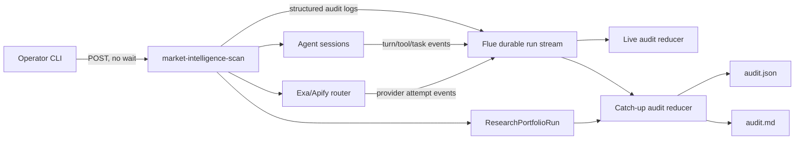

# Research Run Audit Trail Implementation Blueprint

> **For agentic workers:** REQUIRED SUB-SKILL: Use `superpowers:executing-plans` to implement this plan task-by-task. Apply `invariant-driven-execution` to every task. Steps use checkbox (`- [ ]`) syntax for tracking.

**Goal:** Give operators live, stage-aware visibility into every research run and produce deterministic JSON and Markdown audit artifacts that attribute time, model tokens, model cost, tools, provider attempts, decisions, and outcomes.

**Architecture:** Flue's authenticated durable workflow event stream remains the raw execution record. The application emits stable research-stage events through the existing Flue logger; a project-owned reducer combines those events with Flue turn/tool events and the final run result. A CLI watches the stream live or exports a compact metadata-only report without copying prompts, thinking content, fetched page bodies, or tool results.

**Tech Stack:** TypeScript 5.9, Flue `@flue/runtime` and `@flue/sdk` 1.0 beta, Cloudflare Durable Objects, Valibot, Node.js CLI scripts, Vitest.

## Control Block

- Blueprint version: v1
- Status: VALIDATED
- Prepared on: 2026-07-23
- Project revision or working-tree basis: `/Users/mac/Codemine-Mac/Work/Emma/publication/agent`; no Git repository metadata is present
- Request owner: publication project owner
- Approver: publication project owner
- Supersedes: none
- Approval evidence: pending

## Global Constraints

- Preserve `POST /workflows/market-intelligence-scan` and `GET /runs/:runId`.
- Keep `researchAdminFromEnv` on workflow invocation and run inspection.
- Keep Flue's durable run stream as the only raw runtime-event source.
- Do not add a second database, Durable Object, hosted tracing vendor, or dashboard in this sprint.
- Do not persist raw prompts, system instructions, thinking deltas, model messages, tool arguments/results, fetched content, credentials, or request headers in the compact audit report.
- Count model usage from terminal `turn` events only. Do not add operation or compaction aggregates to turn totals.
- Do not sum nested wall-clock durations. Calculate run duration from timestamps and stage wall time from paired application events.
- Treat Durable Streams delivery as at least once. Deduplicate by `(runId, eventIndex)`.
- Provider admitted estimates and reported vendor costs are separate measures.
- Audit collection must not block or fail the research workflow.
- Live status and exported reports remain protected by the existing research-admin bearer token.
- Exported files are opt-in operator artifacts and must be ignored by Git.
- Writing and publishing remain outside this feature.

---

## Executive Decision

Build a project-owned audit projection over Flue's current run event stream.

Flue already persists workflow lifecycle, operation, task, model-turn, tool, log, and error events. The missing layer is publication context: phase, brief, market, agent profile, reviewer decision, provider attempt, budget movement, and artifact counts. The application will emit that context as structured `log` events with schema version `1`.

The CLI provides:

```text
npm run scan -- --input ./scan.json
npm run audit:watch -- --run-id run_...
npm run audit:export -- --run-id run_... --out ./research-runs
```

`scan` admits the workflow without `?wait=result`, prints the `runId`, and attaches the live watcher. `audit:watch` can attach to an existing run. `audit:export` creates:

```text
research-runs/<runKey>/audit.json
research-runs/<runKey>/audit.md
```

The difficult-to-reverse decision is the audit event contract. It is versioned from the first release. The CLI presentation and report fields are reversible projections.

No external observability service is added. Flue's native event contract already covers the runtime facts, and the current project needs publication-specific accounting before it needs hosted trace search.

## Execution Contract

### Invariants

- Every pipeline stage emits one terminal event for each emitted start event.
- Every terminal agent task can be correlated to its phase, session, agent, brief, and market.
- Every provider attempt records estimate, reported cost, latency, status, retry number, and a redacted error classification.
- Model cost and tokens are summed once from terminal `turn` events.
- Stream replay produces byte-equivalent report data except `generatedAt`.
- Duplicate stream batches cannot duplicate audit entries or totals.
- A report never contains secrets, raw model content, thinking content, fetched page bodies, or tool results.
- Audit emission failure cannot change research decisions or workflow status.
- Existing workflow and provider results remain schema-compatible.

### Dangerous Cases

- Stream reconnection re-delivers a batch.
- A run is active when the watcher attaches.
- A watcher attaches after thousands of thinking deltas.
- A model turn starts but never emits a terminal turn.
- A stage fails before an agent session starts.
- Several articles and markets execute concurrently.
- A provider retries and returns no vendor cost.
- A process restart leaves an interrupted run.
- Event version is not Flue `v: 3`.
- A query, error, or URL contains a credential-like value.
- The admin token is missing or printed by a CLI error.
- An output path contains traversal segments.

### Required Test Files

- `tests/research/run-audit-events.test.ts`
- `tests/research/run-audit-projection.test.ts`
- `tests/research/run-audit-cli.test.ts`
- `tests/fixtures/research/flue-run-events.json`
- Existing regression suites under `tests/research/`

### Required Negative Tests

- Replayed event batches do not change totals.
- Unsupported event versions fail export with a clear non-sensitive error.
- Raw content event families are excluded.
- Credential-like strings are redacted.
- Missing terminal events appear as `interrupted`, not `succeeded`.
- Unauthorized run inspection remains denied.
- Audit logger exceptions do not fail the research pipeline.
- Path traversal is rejected.
- Unknown provider cost remains `null` and increments the unpriced count.

### Regression Surfaces

- Workflow action output schema.
- Discovery failure behavior.
- Article concurrency.
- Provider retries and budget receipts.
- Research-admin authentication.
- Flue build for Cloudflare.

### Completion Evidence

- Red-green evidence for each new behavior.
- `npm run typecheck`
- `npm run test:research`
- `npm run build`
- A local Flue run started without `?wait=result`.
- Live watcher shows stage, turn, tool, and cost progress.
- Exported JSON validates and Markdown contains matching totals.
- Secret scan of both artifacts returns no configured credentials.

## Project Context

- Repository instructions: `AGENTS.md` requires deterministic research controls, provenance, cost bounds, negative tests, and no secret leakage.
- Runtime and framework: Flue 1.0 beta on Cloudflare Workers and Durable Objects; `package.json`, `wrangler.jsonc`, and `flue.config.ts`.
- Entry point: `.flue/workflows/market-intelligence-scan.ts` binds the private coordinator to `.flue/actions/run-foundational-research.ts`.
- Business logic owner: `.flue/research/pipeline.ts::executeResearchPipeline`.
- Agent task boundary: `.flue/research/delegation.ts::executeRecordedTask`.
- Provider attempt boundary: `.flue/providers/web-research/router.ts::executeWithRetry` and `executeApify`.
- Existing aggregate record: `.flue/research/schemas.ts::AgentExecutionRecordSchema`; written only after an agent task ends.
- Existing provider record: `.flue/research/schemas.ts::ProviderCallReceiptSchema`.
- Existing raw observability: authenticated `GET /runs/:runId`; `runs = researchAdminFromEnv` in the workflow module.
- Data persistence: Flue stores workflow records and event streams in generated Durable Object SQLite. The application owns research sources, evidence, receipts, and final results.
- Authorization: one bearer-token policy in `.flue/auth/research-admin.ts`; the same policy protects run streams.
- Tests: Vitest under `tests/research`; `npm run check` runs typecheck, all tests, and Cloudflare build.
- Current operator gap: the blocking `?wait=result` request hides progress, and provider billing rows lack run, phase, brief, market, session, and outcome labels.
- Current event sample: the inspected stream contained `run_start`, `log`, `operation_start`, `task_start`, `agent_start`, `turn_start`, message events, and many `thinking_delta` events. This proves the raw stream exists but is not an operator status view.
- Constraint: Flue excludes `turn_request` from durable HTTP streams. The compact report must not depend on it.
- Constraint: detailed message payloads are not stable before Flue 1.0. The projector must use stable `turn`, `tool`, `operation`, `log`, and lifecycle events only.
- Assumption: a terminal/CLI surface meets the current sprint's visibility need. A browser dashboard is deferred.
- Assumption: existing Flue run retention remains unchanged. Exported artifacts are created only by explicit operator action.
- Unknown: deployed production retention requirements. This does not block the sprint because no new automatic store is introduced.

## Decision Ledger

| ID | Decision | Answer | Source | Consequence | Confidence |
|---|---|---|---|---|---|
| D-01 | Raw source of truth | Flue durable run stream | Flue docs and project workflow | No duplicate raw event store | Confirmed |
| D-02 | Publication context | Versioned structured log attributes | Flue stable `log` event contract | Context is replayable through `/runs` | Confirmed |
| D-03 | Live interface | CLI watcher | User need plus current API-first sprint | No web UI work | Assumed, reversible |
| D-04 | Documentation output | JSON plus Markdown | User request | Machine and human audit artifacts | Confirmed |
| D-05 | Report content | Metadata by default; optional research terms | Privacy and audit need | No raw prompts or results | Assumed, safe default |
| D-06 | Cost source | Terminal turns plus provider receipts | Flue guidance and project budget model | No nested double counting | Confirmed |
| D-07 | Replay identity | `(runId, eventIndex)` | Flue v3 contract | At-least-once reads converge | Confirmed |
| D-08 | New persistence | None | Current Cloudflare/Flue architecture | No schema migration | Confirmed |
| D-09 | Export retention | Operator-owned, opt-in files; Git ignored | No retention requirement supplied | Automated pruning deferred | Assumed, reversible |
| D-10 | Hosted tracing | Deferred | Cost control and available Flue stream | No Langfuse/Phoenix dependency | Confirmed |

## Scope Contract

### Actors and Permissions

- Research operator: starts scans, watches authorized runs, exports audits.
- Publication engineer: compares run efficiency and debugs failures.
- Workflow runtime: emits stage and provider events.
- Model/provider: untrusted source of usage and response data; application validates normalized fields.
- Unauthorized caller: receives the existing denial response and no run metadata.

### In-Scope Requirements

- `REQ-01`: Start a scan and receive `runId` immediately.
- `REQ-02`: Show the currently active stage, article, market, agent, model, and elapsed time while the run is active.
- `REQ-03`: Record every agent task start and terminal state.
- `REQ-04`: Record every persisted model turn with model, tokens, cost, latency, and error status.
- `REQ-05`: Record every tool call with tool name, latency, and error status.
- `REQ-06`: Record every provider attempt, retry, admission estimate, reported cost, request ID, status, and redacted failure class.
- `REQ-07`: Record brief validation, review, remediation, and article terminal decisions.
- `REQ-08`: Export deterministic JSON and readable Markdown.
- `REQ-09`: Attribute usage and time by run, phase, agent, model, brief, market, tool, and provider.
- `REQ-10`: Report outcome efficiency: discovered, accepted, passed, incomplete, rejected, cost per accepted brief, and cost per passed article.
- `REQ-11`: Resume safely after stream disconnect or repeated event delivery.
- `REQ-12`: Keep current workflow and run authorization.
- `REQ-13`: Exclude raw reasoning and sensitive content from compact artifacts.
- `REQ-14`: Preserve partial progress and label incomplete spans after interruption.

### Nonfunctional Requirements

- `NFR-01`: Audit emission adds no awaited network request or external dependency to the workflow.
- `NFR-02`: The reducer is linear in retained events and ignores high-volume delta families.
- `NFR-03`: A 10,000-event catch-up projection completes in under 2 seconds on the local development machine.
- `NFR-04`: Live display updates within 5 seconds of a persisted terminal event under local development.
- `NFR-05`: Audit failure never changes research output or status.
- `NFR-06`: Reports contain no configured API keys or bearer tokens.
- `NFR-07`: JSON uses `auditSchemaVersion: "1"` and rejects unsupported Flue event versions.
- `NFR-08`: Existing tests and Cloudflare build continue to pass.
- `NFR-09`: While a run is active, the watcher refreshes elapsed time every 5 seconds and marks the view stale after 60 seconds without a new persisted event.

### Non-Goals

- `NG-01`: Browser dashboard.
- `NG-02`: External OpenTelemetry, Langfuse, Phoenix, Sentry, or Braintrust export.
- `NG-03`: Raw chain-of-thought storage or display.
- `NG-04`: Prompt and completion replay.
- `NG-05`: Automatic cancellation or model selection based on audit metrics.
- `NG-06`: Cross-run analytics database.
- `NG-07`: Automatic retention deletion.
- `NG-08`: Writing or publishing stages.

## Acceptance Criteria

- `AC-01`: Given a valid scan input, when the operator runs `npm run scan`, then the command prints `runId` before the workflow ends and starts showing live stage events.
- `AC-02`: Given an active run, when an agent task changes stage, then the watcher displays phase, agent, model role, brief/market scope, and elapsed time.
- `AC-03`: Given multiple turns in one task, when each terminal `turn` arrives, then each appears once and aggregate tokens/cost equal the sum of those turn events.
- `AC-04`: Given a tool call and provider retries, then tool totals count the tool once while provider totals count each attempt.
- `AC-05`: Given an unpriced provider response, then reported provider cost stays unknown, the admitted estimate remains separate, and the unpriced count increases.
- `AC-06`: Given concurrent article/market stages, then each stage retains its own `stageId` and scope; one completion cannot close another stage.
- `AC-07`: Given a replayed stream batch, then JSON totals and timeline item counts do not change.
- `AC-08`: Given a run interrupted after stage start, then export labels the stage `interrupted`.
- `AC-09`: Given an unauthorized token, then watch and export receive no run data.
- `AC-10`: Given events containing prompt, thinking, message, tool-result, or fetched content fields, then compact output omits those values.
- `AC-11`: Given a configured secret present inside an error string, then the report contains `[REDACTED]`.
- `AC-12`: Given a completed run, then JSON and Markdown report the same status, totals, tokens, known costs, unpriced calls, and bottleneck stage.
- `AC-13`: Given the current curl endpoint, then invocation and final result behavior remain compatible.
- `AC-14`: Given an unsupported event `v`, then export fails before writing artifacts and names the unsupported version without dumping the event.
- `AC-15`: Given a long-running model turn, then the watcher keeps the phase, agent, model, scope, turn elapsed time, and last-event age visible without printing thinking content.

## Research Synthesis

Evidence checked on 2026-07-23.

### Authoritative Sources

1. Flue Events Reference: `https://flueframework.com/docs/api/events-reference/`
   - Result: authoritative and project-compatible.
   - Adopt: stable v3 lifecycle, turn, tool, operation, log, correlation, and `eventIndex` contracts.
   - Reject: detailed message families as a projection dependency because Flue marks them unstable.
2. Flue Workflows: `https://flueframework.com/docs/guide/workflows/`
   - Adopt: immediate workflow admission followed by authenticated run streaming.
3. Flue SDK run APIs: `https://flueframework.com/docs/sdk/runs/`
   - Adopt: `client.runs.stream()` automatic offset resumption and `client.runs.events()` catch-up.
4. OpenTelemetry GenAI semantic conventions 1.43-era documentation:
   - Adopt names and distinctions for model, provider, operation, conversation, token usage, and workflow.
   - Adapt to the project event schema instead of adding an OpenTelemetry exporter.

### Repository Comparison

| Candidate | Rel. /30 | Compat. /20 | Maint. /15 | Sec. /15 | Tests /10 | Community /10 | Total | Veto | Decision |
|---|---:|---:|---:|---:|---:|---:|---:|---|---|
| `langfuse/langfuse` at `5e4dae6e11f7890ceb105f44fa5a882614a7cda4` | 27 | 13 | 15 | 10 | 9 | 10 | 84 | No code copying | QUALIFIED_ARCHITECTURE |
| `Arize-ai/phoenix` at `052b71f2033b08dc15eb91f018e3e430e1265def` | 26 | 10 | 15 | 7 | 9 | 9 | 76 | Security/license evidence at the exact tag was incomplete | INSUFFICIENT_EVIDENCE |

#### Langfuse Evidence Card

- Repository: `https://github.com/langfuse/langfuse`
- Revision: `5e4dae6e11f7890ceb105f44fa5a882614a7cda4`, release `v3.224.1`
- Intended use: architecture only
- Relevant pattern: nested trace observations with model, tool, timing, usage, and cost; grouping by session/trace name.
- Compatibility: the trace tree and cost breakdown map to Flue events, but its separate services and database do not fit this sprint.
- Maintenance: 628 listed releases, latest release on 2026-07-23, active fixes and dependency updates.
- Security: public policy and advisories; the pinned release includes a credential-masking fix. The policy provides limited supported-version detail.
- License: root repository reports MIT outside enterprise directories, but exact tagged license fetch was unavailable. No code or snippet will be copied.
- Accepted: trace hierarchy, leaf cost accounting, filterable business context.
- Rejected: hosted ingestion, background exporter, content capture, separate database, dashboard.

#### Phoenix Evidence Card

- Repository: `https://github.com/Arize-ai/phoenix`
- Revision: `052b71f2033b08dc15eb91f018e3e430e1265def`, release `arize-phoenix-v17.5.0`
- Intended use: candidate architecture comparison only
- Relevant pattern: OpenTelemetry traces spanning LLM, retrieval, tool, and custom operations.
- Compatibility: trace concepts transfer; Python-heavy service architecture and separate trace storage do not.
- Maintenance: more than 700 listed releases; signed tagged release on 2026-06-12.
- Security/license evidence: exact tagged pages were unavailable during remote inspection. This prevents code use and keeps the candidate below the security floor.
- Accepted: none beyond independently supported trace concepts.
- Rejected: dependency, storage, and UI architecture.

### Remote Security Conclusion

- Coverage: public repository summaries, tagged releases, Flue official contracts, public security-policy evidence, and observability documentation.
- Findings: no external package or code path is being adopted from either candidate.
- Relevant resolved evidence: Langfuse `v3.224.1` lists a fix that masks analytics credentials in read endpoints.
- Unavailable evidence: complete advisory review and exact tagged license files for both candidates; Phoenix security policy at the pinned tag.
- Accepted patterns: stable correlation IDs, nested timing, leaf usage accounting, content-minimized exports.
- Rejected patterns: default content export, hosted ingestion, extra database, automatic background upload.
- Required local mitigations: bearer auth, redaction, metadata-only projection, replay deduplication, output-path validation, secret scan.
- Residual uncertainty: Flue remains beta and may revise event schema after v3. Version rejection and fixture updates are required on upgrade.
- Disposition: PASS for the bespoke project-native design; no external code copying.
- Design classification: `BESPOKE_NO_QUALIFIED_REFERENCE` for implementation code.

## Technical Design

### End-to-End Flow



### Research Audit Event Contract

Create `.flue/research/run-audit.ts`:

```ts
export type ResearchAuditEventName =
	| 'pipeline_started'
	| 'pipeline_completed'
	| 'pipeline_failed'
	| 'stage_started'
	| 'stage_completed'
	| 'stage_failed'
	| 'provider_attempt_started'
	| 'provider_attempt_completed'
	| 'provider_attempt_failed'
	| 'budget_admission_rejected'
	| 'decision_recorded'
	| 'artifact_recorded';

export interface ResearchAuditAttributes {
	auditSchemaVersion: '1';
	auditEvent: ResearchAuditEventName;
	auditId: string;
	runKey: string;
	phase: string;
	stageId: string | null;
	briefId: string | null;
	market: Market | null;
	agent: string | null;
	modelRole: string | null;
	modelId: string | null;
	sessionName: string | null;
	attempt: number | null;
	status: 'started' | 'succeeded' | 'failed' | 'cancelled' | 'interrupted';
	startedAt: string | null;
	completedAt: string | null;
	durationMs: number | null;
	provider: 'exa' | 'apify' | null;
	providerRequestId: string | null;
	operation: string | null;
	mode: string | null;
	admittedEstimateUsd: number | null;
	reportedCostUsd: number | null;
	decision: string | null;
	counts: Record<string, number>;
	errorClass: string | null;
	errorCode: string | null;
}
```

All application audit events use:

```ts
log.info('research.audit', attributes);
```

Failures use `log.warn` for expected degraded results and `log.error` only for pipeline-terminal failures. `auditId` is deterministic from the business identity:

```text
stage:<runKey>:<phase>:<briefId-or-none>:<market-or-none>:<attempt>
provider:<provider-call-key>:<attempt>
budget:<provider-call-key>:<attempt>
decision:<runKey>:<decision-kind>:<briefId>
```

`createResearchAuditEmitter(log, runKey, clock)` catches logger exceptions. It returns stage handles so concurrent stages cannot close each other.

### Stage State Model

```text
planned -> active -> succeeded
                  -> failed
                  -> cancelled
                  -> interrupted (projection only)
```

Stages:

- `pipeline`
- `discovery`
- `brief-validation`
- `brief-refinement`
- `article`
- `deep-research`
- `structural-analysis`
- `review`
- `remediation`

The projector marks an active stage `interrupted` only after terminal `run_end`, `run_resume` settlement, or a closed event stream without a paired terminal stage event.

### Runtime Event Projection

The reducer accepts `FlueEvent[]` incrementally:

```js
createAuditProjection({ runId, redact })
projection.ingest(event)
projection.snapshot()
projection.finalize(runRecord)
```

Retained families:

- `run_start`, `run_resume`, `run_end`
- `operation_start`, `operation`
- `task_start`, `task`
- `turn_start`, `turn`
- `tool_start`, `tool`
- `compaction_start`, `compaction`
- `log` where `message === "research.audit"`
- `submission_settled`

Ignored families:

- `turn_request`
- `turn_messages`
- `message_start`, `message_end`
- `text_delta`
- `thinking_start`, `thinking_delta`, `thinking_end`
- `agent_start`, `agent_end` unless needed for interruption diagnosis

The reducer rejects any event whose `v !== 3`. It deduplicates before any state mutation.

### Correlation

- Run: `runId`.
- Pipeline business identity: `runKey`.
- Flue operation: `operationId`.
- Turn: `turnId`.
- Tool: `toolCallId`.
- Task: `taskId`.
- Parent application stage: `stageId`.
- Session mapping: prefer explicit audit `sessionName`; for a child task session use `parentSession`; otherwise use `session`.
- Article scope: `briefId`.
- Region scope: `market`.

### Cost and Efficiency Rules

Model totals:

```text
modelInputTokens  = sum(turn.response.usage.input)
modelOutputTokens = sum(turn.response.usage.output)
modelCostUsd      = sum(turn.response.usage.cost.total)
```

Only terminal `turn` events contribute. Failed turns contribute their reported usage and are also grouped under failed work.

Provider totals:

```text
providerAdmittedEstimateUsd = sum(unique provider attempt admittedEstimateUsd)
providerReportedCostUsd     = sum(non-null reportedCostUsd)
providerUnpricedCalls       = count(completed attempts with null reportedCostUsd)
```

Outcome metrics:

```text
knownTotalCostUsd = modelCostUsd + providerReportedCostUsd
costPerAcceptedBrief = knownTotalCostUsd / accepted
costPerPassedArticle = knownTotalCostUsd / passed
acceptanceRate = accepted / discovered
passRate = passed / accepted
contextAmplification = modelInputTokens / max(modelOutputTokens, 1)
```

Unknown vendor cost never becomes the admission estimate in `providerReportedCostUsd`. The report shows both values.

Duration rules:

- Run wall time: `run_end.timestamp - run_start.timestamp`.
- Stage wall time: paired application stage events.
- Turn/tool latency: terminal event `durationMs`.
- Bottleneck stage: greatest terminal stage wall time.
- Parallel stages may overlap; their durations are not summed into run duration.

### Live Terminal View

Default concise lines:

```text
17:41:02  START  discovery           discovery_orchestrator  deepseek-v4-flash
17:41:28  TURN   discovery           55,188 in / 134 out     $0.0002  26.1s
17:41:29  TOOL   search_web          nigeria                 1.8s
17:41:31  EXA    search attempt 1    nigeria                 $0.0070
17:42:10  END    discovery           12 briefs               68.0s
```

The footer refreshes after terminal events:

```text
Active: brief-validation (4/12 complete) | LLM $0.0192 | Provider $0.0420 known | 78,402 tokens | 2m 18s
```

While a run remains active, a local 5-second heartbeat refreshes the active stage and turn elapsed time even when no new terminal event has arrived. After 60 seconds without a persisted event, it adds `STALE` and the last-event age. Thinking deltas may advance the last-event timestamp, but their content is never retained or printed.

Do not print thinking or model output. `--json` prints sanitized projected events for automation.

### JSON Report Contract

```ts
interface ResearchRunAuditReport {
	auditSchemaVersion: '1';
	generatedAt: string;
	run: {
		runId: string;
		runKey: string;
		workflowName: string;
		status: string;
		startedAt: string;
		endedAt: string | null;
		durationMs: number | null;
	};
	currentStage: AuditStage | null;
	timeline: AuditTimelineEntry[];
	stages: AuditStage[];
	efficiency: {
		model: UsageBreakdown;
		provider: ProviderUsageBreakdown;
		byPhase: UsageBreakdown[];
		byAgent: UsageBreakdown[];
		byModel: UsageBreakdown[];
		byBrief: UsageBreakdown[];
		byMarket: UsageBreakdown[];
		tools: ToolBreakdown[];
		outcomes: OutcomeEfficiency;
	};
	artifacts: {
		sourceCount: number;
		evidenceCount: number;
		claimCount: number;
		providerReceiptCount: number;
	};
	decisions: AuditDecision[];
	bottlenecks: AuditBottleneck[];
	warnings: AuditWarning[];
}
```

`generatedAt` is excluded from deterministic equality tests. Arrays sort by stable keys, then timestamp and event index.

### Markdown Report

Sections:

1. Run identity and outcome.
2. Current/terminal status.
3. Stage timeline.
4. Agent and model usage.
5. Tool and provider usage.
6. Brief and reviewer decisions.
7. Outcome efficiency.
8. Bottlenecks and failed/retried work.
9. Artifact counts.
10. Redaction and completeness notes.

### Authentication and Secret Handling

- CLI requires `RESEARCH_ADMIN_TOKEN`.
- CLI accepts `FLUE_BASE_URL`, defaulting to `http://127.0.0.1:3583`.
- Token is sent only in the `Authorization` header.
- Token and provider credentials never appear in arguments, URLs, logs, or reports.
- The redactor receives configured secrets from environment and replaces exact matches with `[REDACTED]`.
- It also masks bearer tokens, `x-api-key` values, and common key prefixes in errors.
- Report output paths are resolved under the requested directory; derived `runKey` path segments allow only `[A-Za-z0-9._-]`.

### Failure Taxonomy

| Failure | Behavior |
|---|---|
| Unauthorized/404 run | CLI exits nonzero without guessing whether the run exists |
| Stream disconnect | SDK reconnects from the last opaque offset |
| Duplicate batch | Reducer ignores existing `(runId,eventIndex)` |
| Unsupported event version | Abort export before file write |
| Active run export | Mark report `active`; unclosed stages remain `active` |
| Closed/interrupted run | Mark unclosed stages `interrupted` |
| Missing usage | Preserve `null`; add warning |
| Missing provider cost | Increment unpriced count; do not invent cost |
| Audit logger throws | Continue workflow; local console warning at most |
| Markdown write fails | JSON and Markdown writes use temporary files then rename independently; report exact failed path |
| Partial final result | Export completed timeline and partial outcome fields |

### Rollout and Rollback

1. Add emitters and reducer behind no feature flag; events are additive logs.
2. Ship CLI and docs.
3. Verify locally with one bounded scan.
4. Deploy without storage migration.
5. Rollback by reverting emitter and CLI changes. Existing added log events remain readable and harmless.
6. If Flue event version changes, block export and update fixtures/projector before re-enabling.

## File and Symbol Change Plan

| Order | Requirement IDs | File | Symbol | Change |
|---:|---|---|---|---|
| 1 | REQ-03, REQ-06, REQ-07, REQ-13 | Create `.flue/research/run-audit.ts` | `createResearchAuditEmitter` | Stable application audit event contract, stage handles, redaction-safe fields |
| 2 | REQ-01, REQ-02, REQ-08–REQ-14 | Create `scripts/lib/research-audit-projection.mjs` | `createAuditProjection`, `renderAuditMarkdown` | Replay-safe reducer and report renderer |
| 3 | REQ-02, REQ-08, REQ-11, REQ-12 | Create `scripts/research-audit.mjs` | CLI `watch` and `export` | Authenticated stream client, live display, atomic artifact writes |
| 4 | REQ-01, REQ-02 | Create `scripts/run-research-scan.mjs` | scan CLI | Immediate admission and watcher attachment |
| 5 | REQ-03, REQ-07, REQ-14 | Modify `.flue/research/pipeline.ts` | `executeResearchPipeline`, `processArticle` | Emit stage and decision events at deterministic boundaries |
| 6 | REQ-03, REQ-04 | Modify `.flue/research/delegation.ts` | `executeRecordedTask`, `ResearchToolBindings` | Emit agent-task start/end/failure with scope |
| 7 | REQ-06 | Modify `.flue/providers/web-research/router.ts` | router config and attempt executors | Emit provider attempt start/end/failure without secrets |
| 8 | REQ-06 | Modify `.flue/research/runtime.ts` | `createResearchRuntime` | Pass optional audit emitter into router |
| 9 | REQ-01, REQ-03 | Modify `.flue/actions/run-foundational-research.ts` | action `run` | Create emitter and pass it through runtime, bindings, pipeline |
| 10 | REQ-01, REQ-08, REQ-12 | Modify `package.json`, `package-lock.json` | scripts/dependency | Add explicit `@flue/sdk` and audit commands |
| 11 | REQ-08, REQ-13 | Modify `.gitignore` | audit artifact ignore | Ignore `research-runs/` and temporary audit files |
| 12 | All | Create tests and sanitized fixture | listed test files | Positive, negative, replay, auth, redaction, CLI tests |
| 13 | All | Create `docs/runbooks/research-audit.md`; modify `README.md` and `docs/runbooks/research-scan.md` | operator docs | Invocation, live view, export, field definitions, incident steps |

## Edge-Case Matrix

| Edge ID | Trigger | Expected Behavior | Guardrail | Telemetry | Test |
|---|---|---|---|---|---|
| EDGE-01 | Duplicate stream batch | No duplicate totals | `(runId,eventIndex)` set | duplicate count | T-PROJ-02 |
| EDGE-02 | Out-of-order terminal event | Correlate by IDs; stable sort | ID maps | warning | T-PROJ-03 |
| EDGE-03 | Stage never terminates | Active or interrupted | run terminal state | warning | T-PROJ-04 |
| EDGE-04 | Unsupported `v` | No output file | version gate | CLI error | T-CLI-03 |
| EDGE-05 | Unauthorized | No data | existing middleware | HTTP status only | Existing auth plus T-CLI-04 |
| EDGE-06 | Secret in error | Redacted | secret redactor | redaction count | T-PROJ-05 |
| EDGE-07 | Provider retry | One row per attempt | provider call identity | retry count | T-EVENT-04 |
| EDGE-08 | Unknown vendor cost | Preserve unknown | separate cost fields | unpriced warning | T-PROJ-06 |
| EDGE-09 | Concurrent markets | Independent stages | deterministic `stageId` | active stage count | T-EVENT-03 |
| EDGE-10 | Audit logger throws | Workflow continues | no-throw emitter | local warning | T-EVENT-05 |
| EDGE-11 | Huge delta volume | Ignore content deltas | event allowlist | ignored count | T-PERF-01 |
| EDGE-12 | Path traversal run key | Reject | safe segment validator | CLI error | T-CLI-05 |
| EDGE-13 | Partial result | Preserve known work | nullable fields | partial warning | T-PROJ-07 |
| EDGE-14 | Process restart | Stream replay converges | opaque offsets plus dedupe | resume count | T-CLI-06 |
| EDGE-15 | Output write interruption | No half-written target | temp file plus rename | write error | T-CLI-07 |
| EDGE-16 | Long active model turn | Elapsed time and last-event age remain visible | local watcher heartbeat | stale marker | T-CLI-08 |
| EDGE-17 | Budget rejects provider call | Rejection appears without a provider-attempt start | budget audit event | rejection count | T-EVENT-06 |

## Defensive Test Plan

| Test ID | Level | Requirements | Expected Evidence | Criticality |
|---|---|---|---|---|
| T-EVENT-01 | Unit | REQ-03 | Stage start and completion share `stageId` | Critical |
| T-EVENT-02 | Unit | REQ-07 | Decisions carry brief and phase scope | Critical |
| T-EVENT-03 | Unit | REQ-03 | Concurrent stages close independently | Critical |
| T-EVENT-04 | Unit | REQ-06 | Provider retry attempts remain distinct | Critical |
| T-EVENT-05 | Unit | NFR-05 | Throwing logger cannot fail caller | Critical |
| T-EVENT-06 | Unit | REQ-06 | Budget rejection is visible without a provider request | Critical |
| T-PROJ-01 | Unit | REQ-04, REQ-05 | Turn/tool totals use terminal events | Critical |
| T-PROJ-02 | Unit | REQ-11 | Replay produces identical report | Critical |
| T-PROJ-03 | Unit | REQ-11 | Reordered terminal events correlate | High |
| T-PROJ-04 | Unit | REQ-14 | Missing terminal becomes interrupted | Critical |
| T-PROJ-05 | Security | REQ-13 | Secrets/raw content absent | Critical |
| T-PROJ-06 | Unit | REQ-06 | Unknown cost is not replaced by estimate | Critical |
| T-PROJ-07 | Unit | REQ-14 | Partial result remains exportable | Critical |
| T-PROJ-08 | Contract | REQ-08 | JSON/Markdown totals match | Critical |
| T-CLI-01 | Unit | REQ-01 | Scan invocation omits wait=result | Critical |
| T-CLI-02 | Integration | REQ-02 | Watcher handles finite fixture stream | Critical |
| T-CLI-03 | Contract | NFR-07 | Unsupported event version blocks write | Critical |
| T-CLI-04 | Security | REQ-12 | Unauthorized endpoint remains denied | Critical |
| T-CLI-05 | Security | REQ-13 | Traversal output path rejected | Critical |
| T-CLI-06 | Unit | REQ-11 | Resume from checkpoint avoids skipped events | High |
| T-CLI-07 | Unit | REQ-08 | Failed write leaves no final partial file | High |
| T-CLI-08 | Unit | NFR-09, AC-15 | Active turn heartbeat and stale age update without content | Critical |
| T-PERF-01 | Performance | NFR-02, NFR-03 | 10,000-event projection under 2 seconds | High |
| T-REG-01 | Regression | NFR-08 | Existing research suite passes | Critical |
| T-REG-02 | Build | NFR-08 | Cloudflare build passes | Critical |
| T-E2E-01 | Manual local | AC-01–AC-12 | One bounded live scan and artifacts | Critical |

## Guardrail Register

| Risk ID | Risk | Prevention | Detection | Response | Residual Risk | Owner |
|---|---|---|---|---|---|---|
| R-01 | Secret leakage | Allowlisted fields plus redactor | Artifact secret scan | Delete artifact, rotate exposed key, fix redactor | Unknown secret formats | Publication engineer |
| R-02 | Cost double count | Leaf turn-only rule | Fixture total assertions | Block export release | Provider may omit cost | Publication engineer |
| R-03 | Misleading wall time | Paired stage timing; no nested sum | overlap tests | Label overlapping stages | Clock skew inside one runtime is small | Publication engineer |
| R-04 | Duplicate events | event identity set | replay test | Rebuild report | Memory grows with event count | Publication engineer |
| R-05 | Audit harms workflow | synchronous no-throw logger only | failure injection | Drop audit event, continue run | Missing context event | Workflow owner |
| R-06 | Flue beta schema change | require v3 | contract fixture | Block and update projector | Upgrade work required | Workflow owner |
| R-07 | Unauthorized inspection | existing bearer middleware | negative auth tests | Deny and investigate | One shared admin token | Project owner |
| R-08 | Large event stream | ignore deltas; incremental reducer | projection benchmark | use catch-up pagination | Raw Flue stream still stores deltas | Workflow owner |
| R-09 | Half-written report | temp write and atomic rename | write-failure test | rerun export | Filesystem-dependent rename behavior | Operator |
| R-10 | Misread unknown cost | separate known/admitted fields | report warnings | reconcile provider bill | Vendor billing may lag | Project owner |

## Delivery Plan

### Task 1: Audit Event Contract

**Files:**

- Create: `.flue/research/run-audit.ts`
- Test: `tests/research/run-audit-events.test.ts`

**Interfaces:**

- Produces: `ResearchAuditEmitter`, `createResearchAuditEmitter(log, runKey, clock)`.
- Consumes: `FlueLogger`, `Market`.

- [ ] Write failing tests for stable IDs, paired stages, no-throw logging, decision events, and provider attempts.
- [ ] Run `npm test -- --run tests/research/run-audit-events.test.ts`; expect failures because the module does not exist.
- [ ] Implement the exact version-1 attributes and allowlisted error classification.
- [ ] Run the focused test; expect all tests to pass.

### Task 2: Deterministic Projection

**Files:**

- Create: `scripts/lib/research-audit-projection.mjs`
- Create: `tests/fixtures/research/flue-run-events.json`
- Test: `tests/research/run-audit-projection.test.ts`

**Interfaces:**

- Produces: `createAuditProjection`, `renderAuditMarkdown`, `redactAuditValue`.
- Consumes: Flue v3 events, application audit logs, optional final run record.

- [ ] Create a sanitized fixture covering two stages, two turns, one tool, provider retry, decision, partial outcome, and duplicate event.
- [ ] Write failing reducer tests for event allowlisting, dedupe, cost rules, correlation, interruption, stable ordering, and redaction.
- [ ] Run focused tests and confirm the missing-module failure.
- [ ] Implement the reducer with maps keyed by stable correlation IDs.
- [ ] Implement Markdown rendering from the finalized JSON report only.
- [ ] Re-run and confirm JSON/Markdown total parity.

### Task 3: Audit CLI

**Files:**

- Create: `scripts/research-audit.mjs`
- Test: `tests/research/run-audit-cli.test.ts`
- Modify: `package.json`
- Modify: `package-lock.json`

**Interfaces:**

- Produces commands `watch` and `export`.
- Consumes `createFlueClient`, the projection library, `RESEARCH_ADMIN_TOKEN`, and `FLUE_BASE_URL`.

- [ ] Add explicit `@flue/sdk@^1.0.0-beta.9`.
- [ ] Write failing argument, auth-header, path-safety, atomic-write, and unsupported-version tests.
- [ ] Implement:

```json
{
	"audit:watch": "node --env-file-if-exists=.dev.vars scripts/research-audit.mjs watch",
	"audit:export": "node --env-file-if-exists=.dev.vars scripts/research-audit.mjs export"
}
```

- [ ] Keep token values out of thrown errors and process arguments.
- [ ] Run focused tests.

### Task 4: Immediate Scan CLI

**Files:**

- Create: `scripts/run-research-scan.mjs`
- Modify: `package.json`
- Test: `tests/research/run-audit-cli.test.ts`

**Interfaces:**

- Produces: `npm run scan -- --input <path>`.
- Consumes: `client.workflows.invoke`, shared watcher.

- [ ] Write a failing test proving invocation returns before a terminal event and omits `wait=result`.
- [ ] Implement input-file parsing through the existing workflow contract.
- [ ] Print `runId`, attach live watch, and export on terminal completion when `--out` is supplied.
- [ ] Run focused tests.

### Task 5: Pipeline and Agent Stage Events

**Files:**

- Modify: `.flue/actions/run-foundational-research.ts`
- Modify: `.flue/research/pipeline.ts`
- Modify: `.flue/research/delegation.ts`
- Modify: `tests/research/pipeline.test.ts`
- Modify: `tests/research/delegation.test.ts`

**Interfaces:**

- Consumes: `ResearchAuditEmitter`.
- Produces: stage, agent-task, artifact-count, and decision log events.

- [ ] Write failing tests for discovery, validation, article/market concurrency, structural analysis, review, remediation, and failure closure.
- [ ] Create the emitter in the Action and pass it through `PipelineDeps` and `ResearchToolBindings`.
- [ ] Wrap stages with `startStage()` and exactly one terminal call in `finally`-safe helpers.
- [ ] Emit decisions after deterministic reconciliation, not from raw model output.
- [ ] Run pipeline and delegation tests.

### Task 6: Provider Attempt Events

**Files:**

- Modify: `.flue/providers/web-research/router.ts`
- Modify: `.flue/research/runtime.ts`
- Modify: `tests/research/provider-router.test.ts`

**Interfaces:**

- Consumes optional audit emitter.
- Produces one start and one terminal event per admitted Exa or Apify attempt.

- [ ] Write failing tests for success, retry, terminal auth failure, cancellation, budget rejection, and unpriced cost. Assert a rejected budget emits `budget_admission_rejected` and no provider-attempt start.
- [ ] Emit start only after budget admission.
- [ ] Emit terminal data from normalized response receipt or redacted provider error.
- [ ] Do not include headers, keys, response bodies, fetched content, or full URLs in default metadata mode.
- [ ] Run provider tests.

### Task 7: Documentation and Artifact Safety

**Files:**

- Create: `docs/runbooks/research-audit.md`
- Modify: `docs/runbooks/research-scan.md`
- Modify: `README.md`
- Modify: `.gitignore`

- [ ] Document nonblocking invocation, watcher attachment, export, report fields, cost semantics, interruption, and incident handling.
- [ ] Add `research-runs/` and audit temporary filenames to `.gitignore`.
- [ ] Document that raw run streams may contain model content and remain admin-only.
- [ ] Document no automatic retention deletion in this sprint.

### Task 8: Verification

- [ ] Run `npm run typecheck`.
- [ ] Run `npm run test:research`.
- [ ] Run `npm run build`.
- [ ] Start `npm run dev`.
- [ ] Run a bounded scan with a new `runKey` and provider ceiling no higher than `$0.25`.
- [ ] Confirm live output includes stage, turn, tool, provider, usage, and cost lines.
- [ ] Export JSON and Markdown.
- [ ] Compare totals across both artifacts.
- [ ] Scan artifacts for every configured secret without printing those secrets.
- [ ] Record results in `docs/evals/research-audit-baseline.md`.

## Traceability Matrix

| Requirement | Files/Symbols | Edge Cases | Tests | Guardrails | Telemetry | Rollback |
|---|---|---|---|---|---|---|
| REQ-01–02, NFR-09, AC-15 | scan CLI, watcher | EDGE-03, 14, 16 | T-CLI-01, 02, 06, 08 | R-05, 08 | stage/turn live lines and stale heartbeat | Remove CLI scripts |
| REQ-03 | emitter, pipeline, delegation | EDGE-03, 09, 10 | T-EVENT-01, 03, 05 | R-03, 05 | stage events | Remove additive events |
| REQ-04–05 | projection | EDGE-02, 11 | T-PROJ-01, T-PERF-01 | R-02, 08 | turn/tool summaries | Project raw stream directly |
| REQ-06 | router, projection | EDGE-07, 08, 17 | T-EVENT-04, 06, T-PROJ-06 | R-02, 10 | provider attempts and budget rejections | Keep existing receipts |
| REQ-07 | pipeline decisions | EDGE-13 | T-EVENT-02, T-PROJ-07 | R-05 | decision events | Final result remains source |
| REQ-08–10 | projection/export | EDGE-09, 13, 15 | T-PROJ-08, T-CLI-07 | R-03, 09, 10 | report tables | Delete exported files |
| REQ-11 | SDK/reducer | EDGE-01, 02, 14 | T-PROJ-02, 03, T-CLI-06 | R-04, 06 | resume/duplicate counts | Full replay |
| REQ-12 | existing middleware | EDGE-05 | T-CLI-04, existing auth tests | R-07 | denied status only | No auth change |
| REQ-13 | projection/redactor | EDGE-04, 06, 12 | T-PROJ-05, T-CLI-03, 05 | R-01, 06 | redaction count | Stop export |
| REQ-14 | projection/finalization | EDGE-03, 13, 14 | T-PROJ-04, 07 | R-05, 06 | interrupted warnings | Raw stream retained |

## Validation Record

| Check ID | Status | Evidence | Residual Risk | Remediation/Owner |
|---|---|---|---|---|
| VAL-01 Control | PASS | Control block v1 | No Git revision | Record working-tree basis |
| VAL-02 Context | PASS | Project files and Flue docs mapped | Flue beta | Version gate |
| VAL-03 Requirements | PASS | REQ/NFR/AC/NG sections | CLI assumption | Reopen blueprint if UI is required now |
| VAL-04 Research | PASS | Sources and candidate table | Some exact repository evidence unavailable | No external code/dependency adopted |
| VAL-05 Security | PASS | Auth/redaction/content minimization | Shared admin token | Existing project constraint |
| VAL-06 Licensing | NOT_APPLICABLE | No copied code/snippet | None | None |
| VAL-07 Architecture | PASS | Raw stream plus projection design | Raw Flue stream can be large | Ignore deltas in projection |
| VAL-08 Changes | PASS | Exact file/symbol table | SDK package must be explicit | Lockfile update |
| VAL-09 Edge cases | PASS | EDGE-01 through EDGE-17 | Deployed retention unknown | No new automatic store |
| VAL-10 Tests | PASS | T-EVENT/T-PROJ/T-CLI/T-E2E matrix | Live provider check costs money | Bound final scan to `$0.25` |
| VAL-11 Operations | PASS | rollout, rollback, runbook plan | No dashboard | Deferred explicitly |
| VAL-12 Traceability | PASS | Traceability matrix | None | None |
| VAL-13 Feasibility | PASS | Existing run stream and SDK | Event version must remain v3 | Contract test |
| VAL-14 Drift | PASS | Material-change triggers below | None | Reapproval required |

## Implementation Gate

- Validation result: PASS; blueprint v1 is VALIDATED.
- Critical omissions: none for the CLI/export sprint.
- Approved version: pending.
- Material-change triggers:
  - adding a browser dashboard;
  - adding a second database or hosted telemetry vendor;
  - capturing raw prompts, model outputs, thinking, tool results, or fetched content;
  - changing authentication or exposing audits to another role;
  - automatic retention/deletion;
  - automatic model cancellation or routing based on audit metrics;
  - changing the workflow result schema.
- Decision requested: Approve blueprint v1 for implementation? Yes / No.
