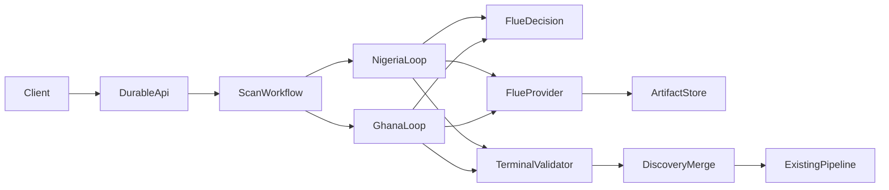

# Durable Discovery Control Design

## Status

Approved design for a discovery-first implementation. Later research stages will adopt the same primitives through separate rollout plans.

## Problem

The current market discovery stage runs one open-ended Flue task per market. Each task may search, fetch, reason, and finalize until a 90-second outer deadline expires. A task can therefore complete all provider work but lose its terminal result while constructing the final brief. The outer timeout is also classified as `provider_timeout`, even when every provider call succeeded.

Failed market tasks recover artifacts from the application ledger, but final audit projection counts only article artifacts. This makes successful paid discovery work appear absent when no article reaches deep research.

The system needs deterministic lifecycle ownership, durable progress, explicit recovery feedback, and mandatory terminal behavior. Time limits remain safety controls for individual operations; they must not be the mechanism that drives stage completion.

## Goals

- Remove the market-wide discovery deadline as a completion mechanism.
- Make every market discovery run resumable across Worker lifetimes.
- Restrict each model invocation to one typed semantic decision.
- Make deterministic code own legal transitions, budgets, retries, validation, and terminal status.
- Preserve receipts, sources, and evidence across every failure path.
- Detect sidetracking through semantic progress rather than elapsed time.
- Force bounded finalization when research capacity is exhausted or progress stalls.
- Distinguish agent-task, provider, validation, checkpoint, and no-progress failures.
- Preserve the existing Flue profiles, provider router, evidence rules, audit data, and downstream pipeline.
- Prove the architecture in discovery before rolling it through later stages.

## Non-goals

- Replacing Flue as the model execution layer.
- Implementing the same state machine across validation, regional research, structural analysis, or review in this slice.
- Increasing provider budgets or search/fetch limits.
- Introducing LATS, multi-agent debate, or an LLM supervisor.
- Publishing content.
- Guaranteeing a valid article brief when evidence is insufficient.

## Architecture Decision

Add a separate Cloudflare Workflows control-plane Worker on the existing Cloudflare account. Keep the current Flue Worker as the execution plane.

The control plane owns:

- Workflow lifecycle and resume.
- Market state transitions.
- Checkpoint and action persistence.
- Budget reservation.
- Legal-action policy.
- Progress detection.
- Terminal validation and repair routing.
- Portfolio merge readiness.

The Flue execution plane owns:

- One-step model decisions.
- Existing model/profile selection.
- Provider execution through the existing router.
- Canonical source and evidence construction.
- Model and provider telemetry.

The existing monolithic Flue scan remains available as a shadow and rollback path during migration.



## Cost Decision

Cloudflare Workflows is included in the current Workers platform. A separate control-plane Worker does not require another cloud provider or another base subscription.

Workers Paid includes 500,000 Workflow steps per month and 1 GB-month of Workflow state. Overage is $0.80 per 100,000 steps. A discovery run is expected to use roughly 20–40 steps, making Workflow step cost negligible relative to model and research-provider cost.

Building recovery inside Flue was rejected because the current architecture explicitly lacks arbitrary TypeScript checkpoint resume. Reimplementing leases, replay, duplicate-resume protection, recovery scheduling, and state migration would duplicate a workflow engine and depend on beta-runtime internals.

## Discovery Action Protocol

Each model invocation returns exactly one action and receives no provider tools:

```typescript
type DiscoveryAction =
	| {
			type: 'search';
			query: string;
			vertical: Vertical;
			tier: SourceTier;
			resultCount: number;
	  }
	| {
			type: 'fetch';
			sourceIds: string[];
			evidenceQuestion: string;
			freshnessMode: 'strict' | 'relaxed';
			maxCharacters: number;
	  }
	| {
			type: 'submit-candidate';
			candidate: MarketDiscoveryAgentResult;
	  }
	| {
			type: 'submit-no-signal';
			reasonCodes: string[];
	  };
```

The action schema is a proposal boundary. An action has no authority until deterministic policy validates and authorizes it.

The model input contains:

- Assigned market and scan window.
- Current state and allowed action types.
- Remaining search, fetch, request, and cost capacity.
- Retained source/evidence IDs with concise evidence summaries.
- Prior action observations.
- Exact validation defects from the previous action.
- Explicit terminal requirements.

## State Machine

```text
decision-pending
  -> search-reserved
  -> decision-pending

decision-pending
  -> fetch-reserved
  -> decision-pending

decision-pending
  -> finalization-pending
  -> completed-signal | completed-no-signal

finalization-pending
  -> repair-pending
  -> finalization-pending

Any active state
  -> failed
```

Search/fetch exhaustion, budget exhaustion, repeated actions, no progress, and decision-step exhaustion transition to `finalization-pending`; they do not cancel the market.

## Checkpoint Contract

Each market has an independently versioned checkpoint:

```typescript
interface DiscoveryMarketCheckpoint {
	schemaVersion: '1';
	runKey: string;
	workflowInstanceId: string;
	market: FoundationMarket;
	revision: number;
	state:
		| 'decision-pending'
		| 'search-reserved'
		| 'fetch-reserved'
		| 'finalization-pending'
		| 'repair-pending'
		| 'completed-signal'
		| 'completed-no-signal'
		| 'failed';
	actionIndex: number;
	finalizationRepairCount: number;
	noProgressCount: number;
	budget: DiscoveryBudgetState;
	pendingAction: DiscoveryActionRecord | null;
	selectedSourceIds: string[];
	sourceIds: string[];
	evidenceIds: string[];
	receiptIds: string[];
	validationErrors: DiscoveryValidationError[];
	progressFingerprint: string;
	terminalResult: MarketDiscoveryResult | null;
	failure: DiscoveryFailure | null;
}
```

Workflow checkpoints contain compact references, counters, hashes, and validation state. Canonical artifacts and action history live in a SQLite-backed Durable Object owned by the control-plane Worker.

## Persistent Records

The append-only store contains:

- `discovery_runs`
- `market_checkpoints`
- `discovery_actions`
- `provider_reservations`
- `provider_observations`
- `source_records`
- `evidence_records`
- `provider_receipts`
- `state_transitions`
- `validation_findings`

Every record is scoped by `runKey`, `market`, and phase. Action and transition records use deterministic IDs.

## System Invariants

- Every workflow input, action, observation, checkpoint, transition, and terminal result is runtime-validated with Valibot.
- A paid provider action cannot begin before its request and cost reservation is durably committed.
- Replaying a committed `actionId` returns the stored observation without issuing another provider call.
- Models cannot author canonical source, evidence, receipt, action, or transition IDs.
- Every retained artifact is scoped by `runKey + market + phase`.
- Every successful fetch remains inspectable if later model work fails.
- Budget and tool counters never roll back after restart.
- At most one pending action exists for a market.
- Exactly one terminal transition is committed for a market.
- Every terminal market result includes all retained receipts, sources, and evidence.
- Nigeria and Ghana progress and failure are independent.
- Downstream validation receives only runtime-valid merged discovery output.
- Audit history is append-only.
- External provider/model text cannot alter workflow policy or allowed actions.

## Supervisor

The supervisor is deterministic:

```typescript
type SupervisorDecision =
	| { type: 'execute'; action: AuthorizedDiscoveryAction }
	| { type: 'redirect'; errors: DiscoveryActionError[] }
	| { type: 'force-finalize'; reason: FinalizationReason }
	| { type: 'terminal'; result: MarketDiscoveryResult }
	| { type: 'fail'; failure: DiscoveryFailure };
```

It validates:

- State/action compatibility.
- Duplicate or materially equivalent searches.
- Source selection against retained search results.
- Budget reservation and remaining capacity.
- Search/fetch/request/cost limits.
- Progress since the prior committed state.
- Terminal claims against canonical artifacts.
- Terminal schema and evidence-contract requirements.

Redirect feedback includes exact error codes, allowed next actions, remaining capacities, retained artifact IDs, and an explicit recovery instruction.

## Semantic Progress

The progress fingerprint includes:

- Search/fetch/request counters.
- Selected, source, evidence, and receipt IDs.
- Satisfied deterministic validation rules.
- Terminal validation error codes.
- Current state.

Changed prose, reordered IDs, or an equivalent query does not count as progress.

Two consecutive no-progress decisions force finalization.

## Bounds

The design removes the market-wide 90-second deadline. It retains explicit safety limits:

- Existing discovery search, fetch, request, and cost limits.
- Maximum 16 semantic decisions per market.
- Maximum two consecutive no-progress decisions.
- Maximum three terminal repair attempts.
- Bounded model and provider operation timeouts.
- Bounded retry/backoff policies by error class.

Limit exhaustion always produces a typed transition and retained state.

## Finalization

Finalization is a separate no-tools model operation.

The finalizer receives only retained canonical artifacts, coverage state, candidate slots, and validator feedback. It must return either a candidate result or no-signal result.

Deterministic validation checks:

- Market and run identity.
- Coverage consistency.
- Canonical source/evidence references.
- Material facts against retained evidence.
- Evidence requirement structure.
- Candidate count.
- Prohibited model-authored provenance.

Invalid output receives exact defects for up to three repair attempts. If repair does not converge, deterministic code emits failed coverage with all retained artifacts.

## Failure Taxonomy

- `agent_task_timeout`
- `provider_timeout`
- `provider_rate_limit`
- `provider_error`
- `provider_outcome_unknown`
- `invalid_action`
- `duplicate_action`
- `no_progress`
- `invalid_terminal_output`
- `budget_exhausted`
- `workflow_interrupted`
- `checkpoint_error`

An outer model-task timeout must never be classified as a provider timeout.

## Recovery Policy

- Model decision timeout: retry the same Workflow step with bounded backoff; then force finalization.
- Provider transient failure: use the existing provider fallback/retry policy within reserved capacity.
- Invalid action: execute nothing and return structured correction.
- Duplicate action: return the committed observation.
- No progress: redirect once, then force finalization.
- Budget/tool exhaustion: force finalization.
- Invalid terminal output: targeted no-tools repair, then typed failure.
- Worker interruption: resume from the last committed Workflow step.
- Unknown provider outcome: do not silently replay; require an explicitly budgeted retry action.
- Checkpoint/audit failure: do not advance state or start another paid action.

## Audit and Observability

Every control-plane event includes:

- Durable Workflow instance ID.
- `runKey`, market, state, revision, and action ID.
- Corresponding Flue run/session/operation IDs.
- Transition reason and supervisor decision.
- Budget before and after.
- Artifact counts and hashes.
- Retry and failure classification.

Audit export merges durable transition records with existing Flue model/provider events. Final artifact counts include discovery artifacts even when no article reaches deep research.

## API Compatibility

- The existing request schema remains the public scan input.
- The durable endpoint returns a Workflow instance identifier and status URL.
- `npm run scan` learns to submit, poll, and export a durable run.
- Existing Flue scan remains available behind an explicit legacy/shadow route during migration.
- Existing downstream portfolio schema remains compatible; new lifecycle metadata is additive and versioned.

## Verification

### Deterministic tests

- Legal and illegal state transitions.
- Schema-version and market/run scoping.
- Reservation-before-provider enforcement.
- Duplicate action replay.
- Exhaustion-to-finalization behavior.
- Selection and terminal provenance checks.
- Progress/no-progress detection.
- Terminal repair limits.
- Artifact retention on every failure.
- Agent/provider timeout classification.

### Recovery tests

Inject interruption:

- Before reservation.
- After reservation.
- During provider execution.
- After provider response but before artifact commit.
- After artifact commit but before Workflow completion.
- During finalization and repair.
- During asymmetric market success/failure.

Prove:

- Resume from the latest valid checkpoint.
- No repeat of committed paid actions.
- No silent replay of unknown outcomes.
- Monotonic counters.
- Exactly one terminal result.
- Complete artifact retention.

### Release gates

- Existing research tests pass.
- Existing offline evaluation remains at its passing baseline.
- New trajectory fixtures cover success, no-signal, invalid/repeated action, repair, provider failure, and resume.
- Controlled shadow scan terminates both markets.
- At least one controlled live run reaches brief validation and deep research.
- Paid-call ledger and retained receipt counts reconcile.
- Successful fetches always produce visible source/evidence counts.
- Timeout classifications identify the failing layer.
- Injected restart produces no duplicate provider call.
- `npm run check` passes.

## Rollout

1. Deploy the control-plane Worker without changing the public scan route.
2. Run deterministic, integration, and fault-injection suites.
3. Run old and durable discovery in controlled shadow mode.
4. Merge Workflow and Flue audit projections.
5. Switch `npm run scan` to the durable endpoint behind configuration.
6. Observe completion, retention, duplicate-call, cost, and deep-research-entry metrics.
7. Keep the legacy route for rollback during the observation period.
8. Remove legacy discovery only after measured parity.
9. Create separate rollout plans for validation, regional research/remediation, structural analysis, and review.

## Success Criteria

- Every market reaches exactly one typed terminal state.
- No market is terminated solely by a stage-wide deadline.
- Successful paid discovery calls remain inspectable after later failure.
- Agent-task and provider failures are classified separately.
- Interrupted runs resume without repeating committed paid actions.
- Controlled live evaluation reaches deep research.
- Existing evidence, budget, source-policy, and downstream review gates do not regress.

